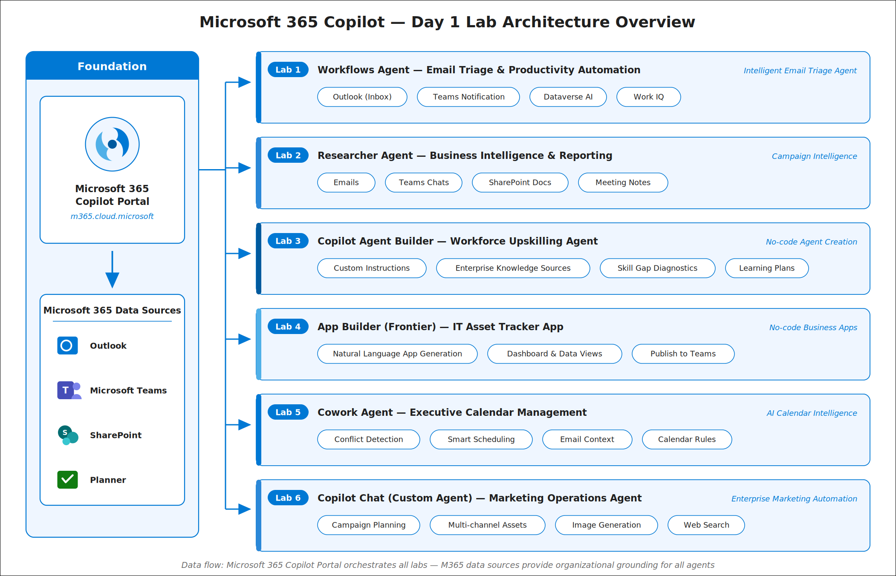
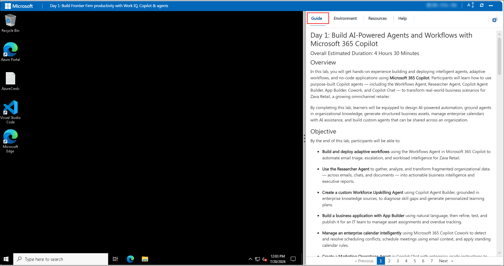
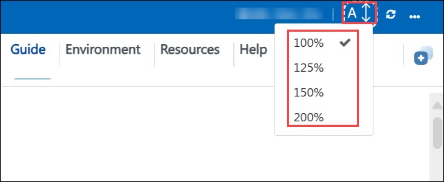
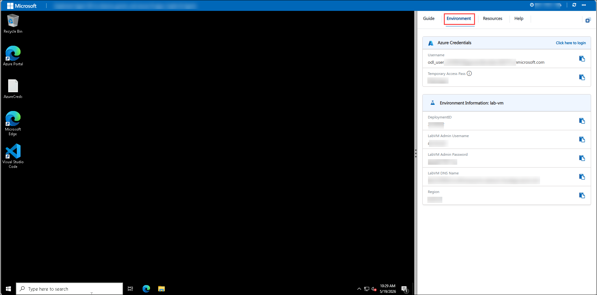
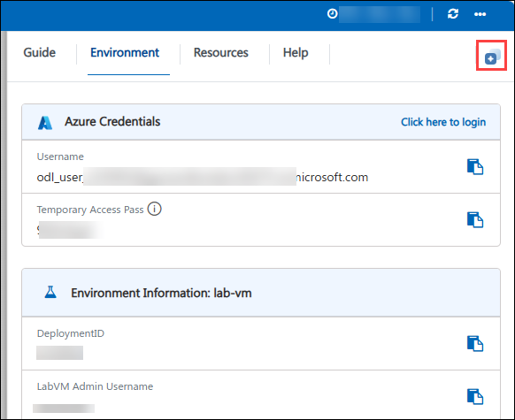
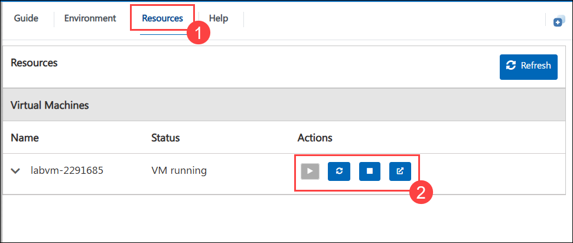
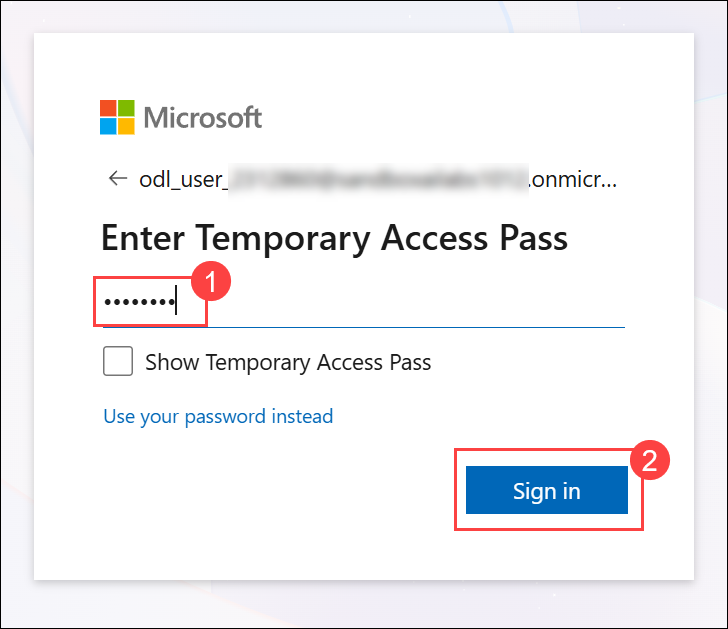
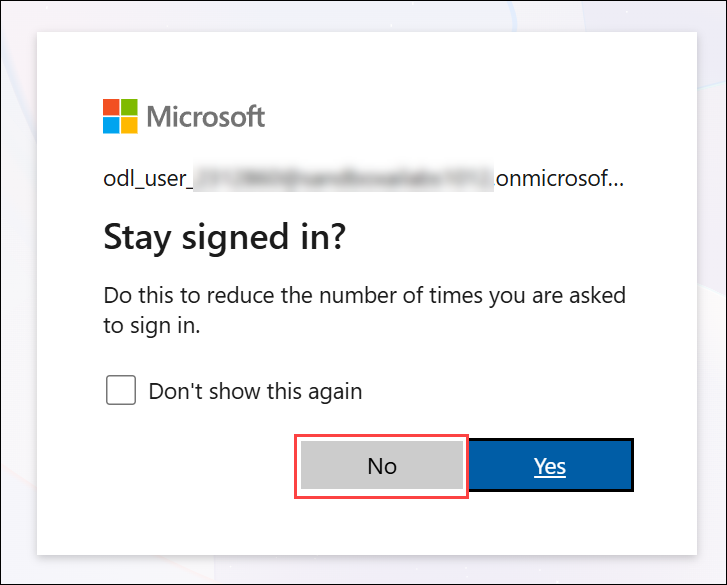

# Day 1: Build AI-Powered Agents and Workflows with Microsoft 365 Copilot

### Overall Estimated Duration: 4 Hours

## Overview

In this lab, you will get hands-on experience building and deploying intelligent agents, adaptive workflows, and no-code applications using **Microsoft 365 Copilot**. Participants will learn how to use purpose-built Copilot agents — including the Workflows Agent, Researcher Agent, Copilot Agent Builder, App Builder, Cowork, and Copilot Chat — to transform real-world business scenarios for Zava Retail, a growing omnichannel retailer.

By completing this lab, learners will be equipped to design AI-powered automation, ground agents in organizational knowledge, generate structured business assets, manage enterprise calendars with AI assistance, and build custom agents that can be shared across an organization.

## Objective

By the end of this lab, participants will be able to:

- **Build and deploy adaptive workflows** using the Workflows Agent in Microsoft 365 Copilot to automate email triage, escalation, and workload intelligence for Zava Retail.

- **Use the Researcher Agent** to gather, analyze, and transform fragmented organizational data — across emails, chats, and documents — into actionable business intelligence and executive reports.

- **Create a custom Workforce Upskilling Agent** using Copilot Agent Builder, grounded in enterprise knowledge sources, to diagnose skill gaps and generate personalized learning plans.

- **Build a business application with App Builder** using natural language, then refine, test, and publish it for an IT team to manage asset assignments and overdue tracking.

- **Manage an enterprise calendar intelligently** using Microsoft 365 Copilot Cowork to detect and resolve scheduling conflicts, schedule meetings using email context, and apply standing calendar rules.

- **Create a Marketing Operations Agent** in Copilot Chat with enterprise-grade instructions to plan campaigns, generate creative assets, adapt content for audiences and regions, and prepare executive approval packages.

## Pre-requisites

Participants should have:

- A Microsoft 365 account with a Copilot license (Microsoft 365 Copilot or Copilot for Microsoft 365).

- Access to Microsoft Outlook, Microsoft Teams, and the Microsoft 365 Copilot portal.

- Basic familiarity with Microsoft 365 applications (Outlook, Teams, SharePoint).

- Understanding of basic business processes such as email management, project coordination, and campaign planning.

## Architecture

In this lab, you will use the Microsoft 365 Copilot platform and its suite of AI-powered agents to automate and enhance business operations at Zava Retail. The workflow begins by accessing purpose-built Microsoft Copilot agents through the Microsoft 365 Copilot portal and Teams.

Each agent is grounded in organizational data — emails, Teams messages, SharePoint documents, and Planner tasks — and uses AI reasoning to plan, execute, and generate outputs across different functional areas including customer support, marketing, HR, IT, and operations.

The Workflows Agent orchestrates multi-step automations by connecting Outlook, Teams, and Dataverse AI. The Researcher Agent aggregates intelligence from across Microsoft 365. The Copilot Agent Builder lets you configure and deploy purpose-built agents with custom instructions and knowledge sources. App Builder generates functional business applications from natural language prompts. Cowork manages calendar intelligence, and Copilot Chat enables enterprise-grade custom agent creation with image generation and web capabilities.

## Architecture Diagram



## Explanation of Components

The architecture for this lab involves the following key components:

1. **Microsoft 365 Copilot Portal (m365.cloud.microsoft):** The primary interface for accessing all Copilot agents, including the Workflows Agent, Researcher Agent, App Builder, Cowork, and Copilot Chat.
   - Acts as the entry point for agent creation and interaction.
   - Provides access to the Agent Store for discovering and adding pre-built Microsoft agents.

1. **Workflows Agent (Frontier):** An AI-powered orchestration engine that enables the creation of intelligent, adaptive workflows using natural language.
   - Connects to Outlook, Teams, Dataverse AI, and other Microsoft 365 services.
   - Enables scheduled and event-driven automation without manual connector configuration.

1. **Researcher Agent:** A pre-built Microsoft Copilot agent that aggregates and analyzes data from Outlook, Teams, and SharePoint documents.
   - Uses AI reasoning to surface insights, action items, risks, and executive summaries.
   - Enables knowledge workers to research and report without manually reviewing hundreds of sources.

1. **Copilot Agent Builder:** A no-code tool for building custom AI agents with defined names, instructions, and knowledge sources.
   - Supports uploading enterprise documents as grounding knowledge for the agent.
   - Allows agents to be shared across an organization for team-wide use.

1. **App Builder (Frontier):** A conversational, no-code application generator inside Microsoft 365 Copilot.
   - Generates functional business applications with dashboards, data views, and task management from natural language prompts.
   - Supports iterative refinement through conversation and publishing to specific groups.

1. **Microsoft 365 Copilot Cowork:** An AI-powered executive calendar assistant.
   - Detects scheduling conflicts, back-to-back meeting runs, and missing agendas.
   - Schedules meetings using email context, applies standing calendar rules, and generates calendar health summaries.

1. **Microsoft 365 Copilot Chat:** The core conversational AI interface for creating custom agents with enterprise-grade instructions.
   - Supports knowledge source uploads, image generation capabilities, and web search integration.
   - Enables marketing operations, campaign planning, and executive content generation.

## Getting Started with Lab

Once you're ready to dive in, your virtual machine and **Guide** will be right at your fingertips within your web browser.



## Lab Guide Zoom In/Zoom Out

To adjust the zoom level for the environment page, click the **A↕ : 100%** icon located next to the timer in the lab environment.



## Virtual Machine & Lab Guide

Your virtual machine is your workhorse throughout the workshop. The guide is your roadmap to success.

## Exploring Your Lab Resources

To get a better understanding of your lab resources and credentials, navigate to the **Environment** tab.



## Utilizing the Split Window Feature

For convenience, you can open the lab guide in a separate window by selecting the **Split Window** button from the top right corner.



## Managing Your Virtual Machine

Feel free to **start, restart, or stop (2)** your virtual machine as needed from the **Resources (1)** tab. Your experience is in your hands!



## Let's Get Started with Microsoft 365 Copilot

1. On your virtual machine, open a web browser and navigate to the Microsoft 365 Copilot portal.

    ```
    https://m365.cloud.microsoft/chat/
    ```

1. On the **Sign in** page, enter the following email/username and click **Next (2)**.

   * **Email/Username**: <inject key="AzureAdUserEmail"></inject> **(1)**
   
      
     
1. Now enter the following password and click on **Sign in (2)**.
   
   * **Password**: <inject key="AzureAdUserPassword"></inject> **(1)**
   
      

      > **Note:** If prompted to Enter Temporary Access Pass, enter the following **Password**: <inject key="AzureAdUserPassword"></inject> **(1)** and click on **Sign in (2)**.

1. If you see the pop-up **Stay Signed in?**, select **No**.

   

1. If you see the pop-up **You have free Azure Advisor recommendations!**, close the window to continue the lab.

1. If a **Welcome to Microsoft 365** popup window appears, select **Maybe Later** to skip the tour.

## Support Contact

The CloudLabs support team is available 24/7, 365 days a year, via email and live chat to ensure seamless assistance at any time. We offer dedicated support channels tailored specifically for both learners and instructors, ensuring that all your needs are promptly and efficiently addressed.

Learner Support Contacts:

- Email Support: cloudlabs-support@spektrasystems.com
- Live Chat Support: https://cloudlabs.ai/labs-support

Click **Next >>** from the bottom right corner to embark on your Lab journey!


### Happy Learning!!
