# Govern and Monitor the Zava Retail Agent Ecosystem with Agent 365

## Scenario

Zava Retail's frontline and project teams are already using two live
agents: the Frontline Operations Assistant, which supports store staff
with schedules, SOPs, and daily operations, and the Project Knowledge
Assistant, which helps employees find project documents and summaries.
With the holiday season approaching, Jordan Blake, VP of Store
Operations, has asked IT to stand up a third agent — a Holiday Returns
Helper — that gives frontline employees short, mobile-friendly answers
about the holiday return window, exchange policy, and refund methods.
Priya Nair, the Store Operations Manager, has written the return-policy
content the agent will rely on and is expected to be named its business
owner once it goes live.

You are Maya Chen, the AI Administrator for Zava Retail. You are
responsible for more than just building this new agent. You need to make
sure it — and every other agent already running in the tenant — is
visible in a single inventory, routed through proper approval before it
goes live, installed where frontline staff will actually use it
(Microsoft Teams), and covered by the same governance controls
(ownership, blocking, risk review, and exportable reporting) that Zava
Retail already applies to its other agents. Partway through your review,
Riley Osei from Compliance & Risk flags a concern about Sam Torres's
Frontline Operations Assistant and asks you to pause it while the
wording of one of its SOP responses is reviewed. In this lab, you will
build the Holiday Returns Helper in Copilot Studio, publish and install
it, then use the Agent 365 Overview and Registry in the Microsoft 365
admin center to inspect, approve, block/unblock, export, and audit
ownership across Zava Retail's full agent ecosystem.

## Personas:

- Maya Chen(AI Administrator, Zava Retail IT)-owns the Agent 365
  Registry and is responsible for approving, publishing, blocking, and
  auditing every agent in the tenant.

- Jordan Blake(VP, Store Operations)- Sponsored the Holiday Returns
  Helper project and requested it be available to all store staff ahead
  of the holiday season.

- Priya Nair(Store Operations Manager)- Day-to-day process owner for
  returns and exchanges. Priya wrote the return-policy content used as
  the agent's knowledge source and is the intended business owner for
  Holiday Returns Helper.

- Riley Osei(Compliance & Risk Analyst)- Submitted the request to
  temporarily block Frontline Operations Assistant pending a
  policy-language review, and will confirm when it's safe to unblock.

## Lab objectives

In this lab, you will:

1.  Create and publish a new agent, Holiday Returns Helper, in Copilot
    Studio using an uploaded knowledge source.

2.  Review the Agent 365 Overview page to understand tenant-wide
    metrics: agent count, active users, pending requests, and ownerless
    agents.

3.  Inspect pending agent requests in the Registry and publish the
    Holiday Returns Helper agent to the store.

4.  Install the newly published agent in Microsoft Teams and verify it
    responds correctly to real user prompts.

5.  Block and unblock an existing agent (Frontline Operations Assistant)
    and understand the impact of each action.

6.  Export the full agent inventory to CSV for offline reporting and
    audit purposes.

7.  Identify agents that are missing a business owner and understand how
    to close that governance gap.

## Agents used in this lab


## Exercise 1: Create a New Agent — Holiday Returns Helper

Build the Holiday Returns Helper agent from scratch in Copilot Studio,
give it clear instructions and a knowledge source, and publish it so it
is ready for governance review. You are building this on behalf of
Jordan Blake's request, using the return-policy document supplied by
Priya Nair as the knowledge source.

1.  Open web browser and navigate to +++https://copilotstudio.preview.microsoft.com/+++

2.  Sign in with the following credentials.

    - Username - <+++@lab.CloudPortalCredential>(User1).Username+++

    - TAP Token - <+++@lab.CloudPortalCredential(User1).AccessToken>+++

    
    
    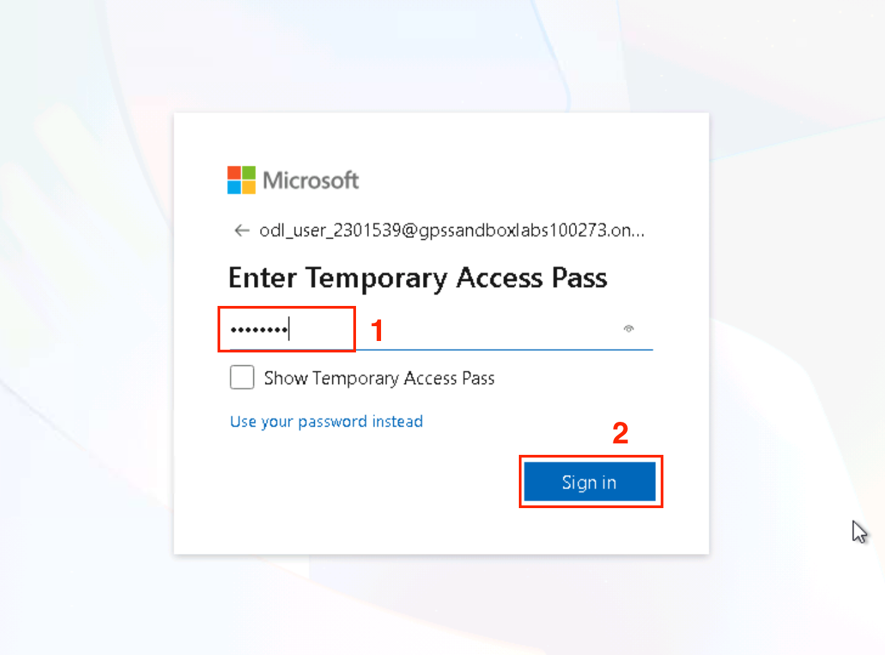

3.  When prompted to stay signed in, select **Yes**.
    
    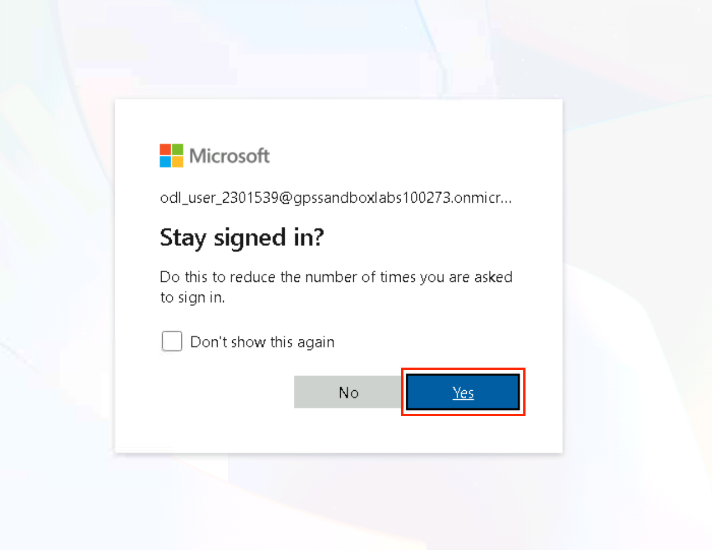

4.  Select **Agent** to build a new agent.

    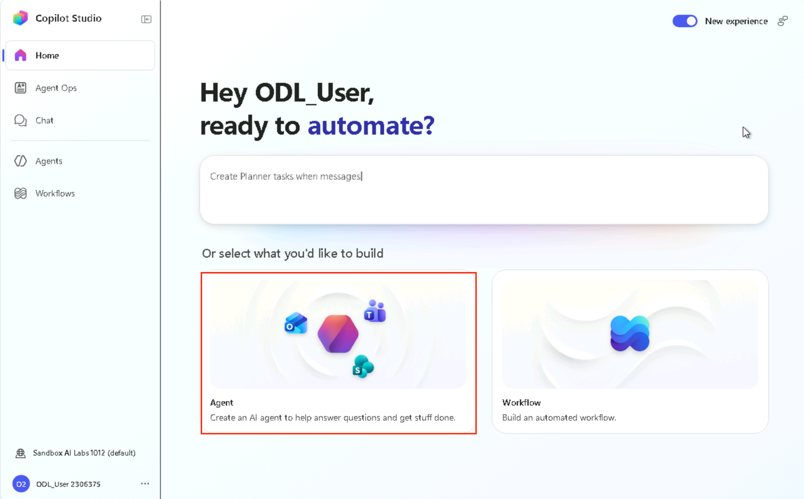

5.  Enter the following details of the agent:

    - **Name:** Holiday Returns Helper

    - **Instructions:**
    ```
    You are Holiday Returns Helper for Zava Retail.
    Your role is to assist store associates with questions about holiday returns, exchanges, and refunds.
    Always answer using information from the uploaded Holiday Return Policy document.
    Keep responses concise, professional, and suitable for frontline employees using a mobile device.
    If the information is not available in the knowledge source, state that you couldn't find the answer rather than making assumptions.
    Do not answer unrelated questions.
    ```
    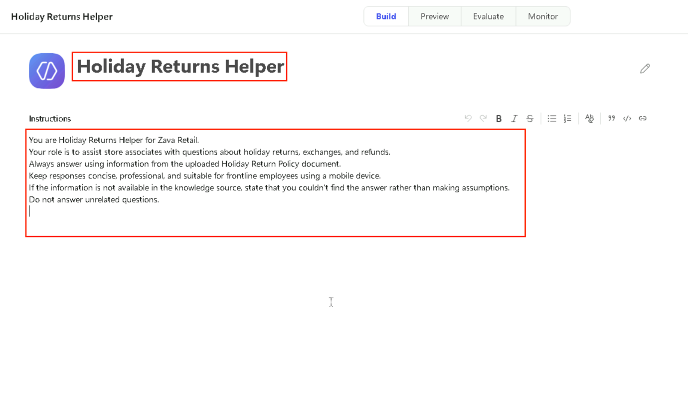

6.  Select **knowledge** from the left navigation menu to add a
    knowledge source from C:\Lab Files\Agent365Lab.

    

7.  Select **Click to upload** the document.

    

8.  Click **Add to agent.**

    

9.  Remove the **search all website** option.

    

10. Click the publish drop-down menu. Make sure Teams + Microsoft 365
    are selected. Turn on Microsoft 365. Click **Save and publish**.

    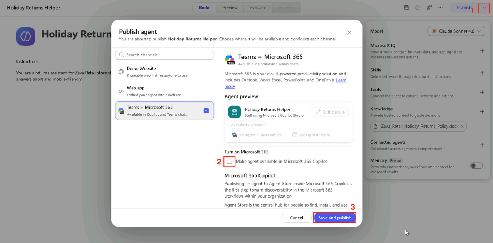

11. Select Publish to publish the agent.

    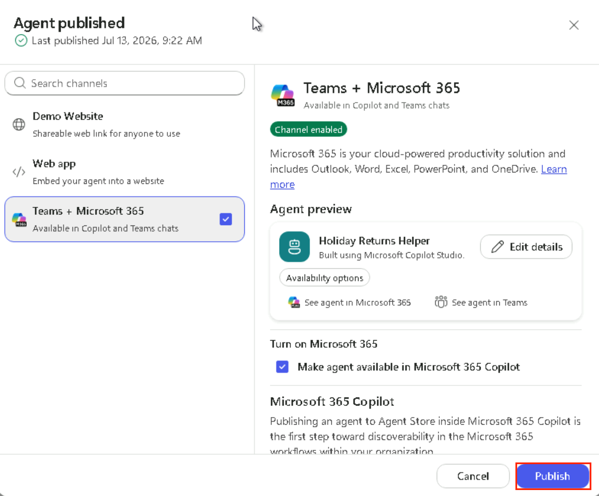

12. Select the **preview** tab to test the agent.

    

13. Enter the following prompt in the prompt field. Select the **Send**
    button.

    ```
    What is the holiday return window?
    ```

    

14. The agent should explain the return window using the uploaded
    policy.
    
    

15. Enter the following prompt and select the **Send** button.

    ```
    Can a customer exchange an item instead of requesting a refund?
    ```

    

16. The exchange policy should match the knowledge document.

    

## Exercise 2: Explore the Agent Registry and Monitor Agent Activity

Get a tenant-wide snapshot of Zava Retail's agent ecosystem — total
agents, active usage, open requests, and ownership gaps — before
drilling into individual agents

1.  Open a browser and navigate to +++https://admin.cloud.microsoft/+++

2.  In the left navigation pane, expand **Agents**, and then
    select **Overview**.

    

3.  On the **Agent Overview** page, locate the following metrics and
    note their current values:

    1.  **Agent Registry** — total count of agents in the tenant.

    2.  **Active users** — unique users who interacted with an agent in
        the last 30 days.

    3.  **Pending requests for agents** — open requests to add specific
        agents.

    4.  **Agents without owners** — agents whose owner has left the
        company.

    5.  **Agent analytics** — agents by creators, top platforms used to
        build agents, and active users in Copilot over time.

    

    

## Exercise 3: Inspect, Publish, and Validate the Holiday Returns Helper Agent

In this exercise, you will review the submitted **Holiday Returns
Helper** agent in the Agent Registry, approve it for organizational use,
publish it to the agent store, install it in Microsoft Teams, and verify
that it provides accurate responses for frontline retail employees.

### Task 1: Review and Publish the Agent from the Agent Registry

Review the submitted Holiday Returns Helper agent in the Agent Registry
and complete the approval workflow so it becomes available to users
across the organization.

1.  In the left navigation pane, select **Agents**. Select **All
    agents**. Then select the **Requests** tab.

    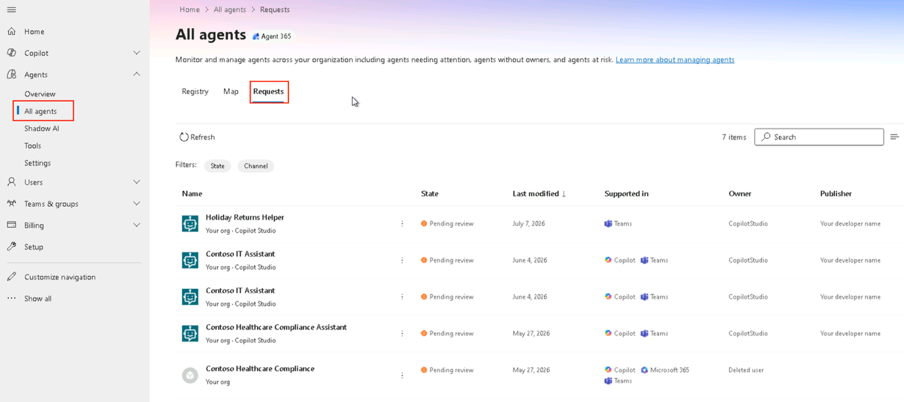

2.  In the agent list, locate **Holiday Returns Helper** agent and
    select the vertical **...** next to the name.

    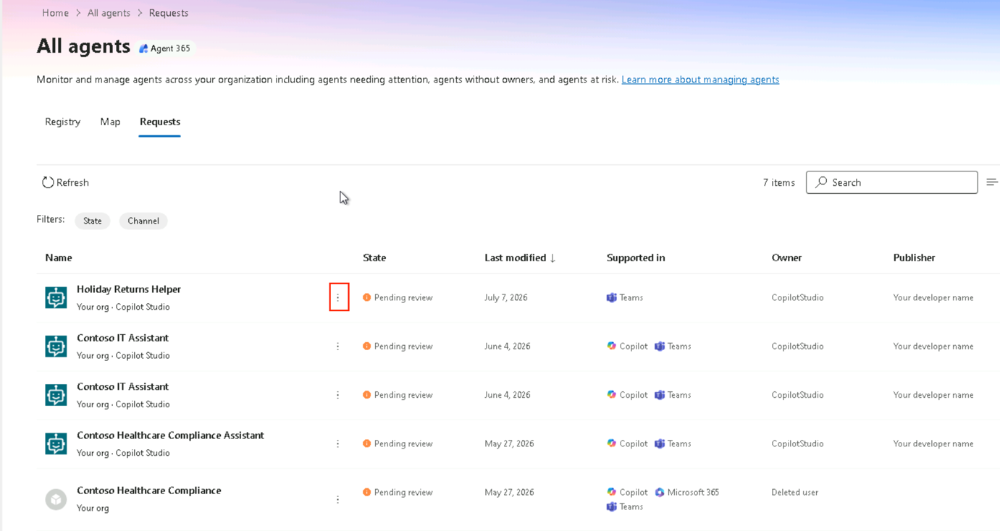

3.  From the two options, you can either **Reject
    submission** or **Publish to store**. For now, select **Publish to
    store**.

    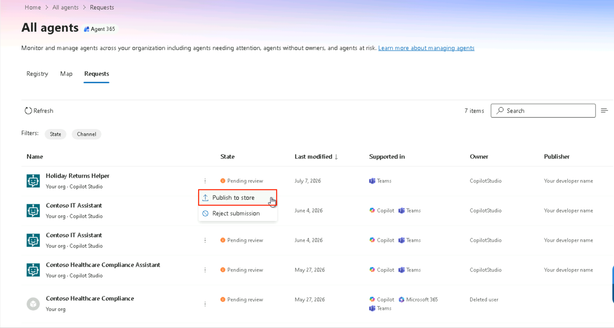

4.  On the **Publish new agent** flow, under **Select users or groups
    who can install the agent**, select **All users**.

    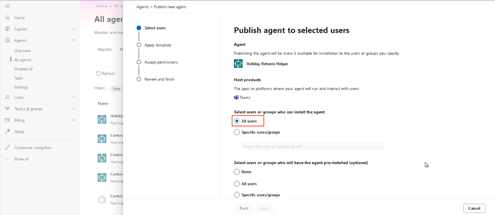

5.  Under **Select users or groups who will have the agent pre-installed
    (optional)**, select All Users.

    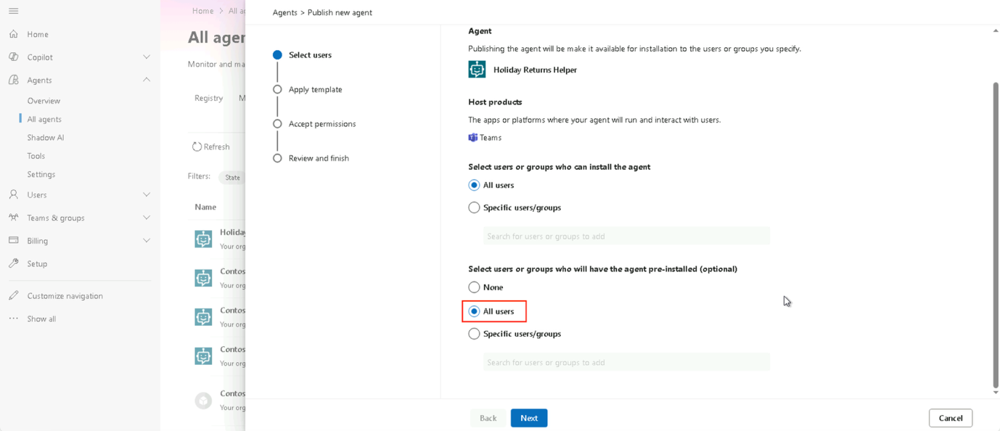

6.  Select **Next**.

    

7.  On **Apply template**, select **Next**.

    

8.  On **Review permissions**, select **Next**.

    

9.  On **Review and finish**, select **Publish**.

    

    

10. The agent is now published and available in the Registry.

    

### Task 2: Install the Agent in Microsoft Teams

Install the published Holiday Returns Helper agent in Microsoft Teams so
it is available to frontline employees during customer interactions.

1.  Open **Microsoft Teams**. Navigate to +++https://teams.cloud.microsoft/+++

2.  In the left navigation pane, select **Apps**. And locate **Holiday
    Returns Helper**.

    

3.  Select **Add** to install the agent.

    

4.  Select **Open**.

    

### Task 3: Verify the Agent's Responses

Test the Holiday Returns Helper agent by asking common customer service
questions and confirm that it provides accurate and relevant responses.

1.  Open the **Holiday Returns Helper** agent in Microsoft Teams.

2.  Enter the following prompt:
    ```
    Can a customer exchange an item instead of requesting a refund?
    ```

    

3.  Review the response and verify that the exchange policy is explained
    correctly.
    
    

    

4.  Enter the following prompt:

    ```
    What refund methods are supported?
    ```

5.  Review the response and verify that the supported refund methods are
    accurately described.

    

    

## Exercise 4: Block and Unblock the Frontline Operations Assistant

Practice the emergency control every AI admin needs: immediately
stopping an agent tenant-wide, and safely restoring it once a concern
has been resolved. Riley Osei from Compliance & Risk has asked you to
pause Sam Torres's Frontline Operations Assistant while a policy-wording
issue is reviewed.

### Task 1: Block an Agent

Use the Registry to halt the Frontline Operations Assistant for all
users and record why it was blocked, per Riley Osei's request.

1.  On the **All agents** page, select the **Registry** tab, then search
    for and select Frontline Operations Assistant in the agent list.

    

2.  On the details panel, select **Block**.

    

3.  On the **Block agent** pane, review the message confirming that
    blocking will prevent all users in the organisation from accessing
    the agent. Check the box next to **Block agent**. Also select the
    reason for block: Not approved for use. Select **Save**.

    

4.  Confirm that Frontline Operations Assistant now displays
    a **Blocked** status.

    

### Task 2: Unblock an Agent

Restore the Frontline Operations Assistant to Active status once Riley
Osei confirms the policy-wording review is complete and the block is no
longer needed.

1.  Select the block agent.

    

2.  On the **Unblock agent** pane, select the **Unblock
    agent** checkbox. 
    
    

3.  Select the unblock agent checkbox. Select **Save**. Close the
    details panel.

    

    

4.  In the agent list, confirm that Frontline Operations Assistant now
    displays an **Active** status.

    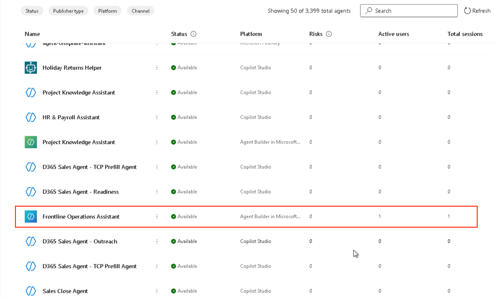

## Exercise 5: Export the Agent Inventory

Produce an offline, shareable record of every agent in the tenant —
useful for audits, leadership reporting, or compliance reviews outside
the admin center.

1.  On the Registry tab, select Export on the toolbar above the agent
    list.

    Note: If an Export button is not visible in the toolbar, select the
    ellipsis (...) menu in the toolbar to locate the export option.

    

2.  Confirm the download in the confirmation dialog. Wait for the export
    file to be generated and downloaded to your lab VM.

    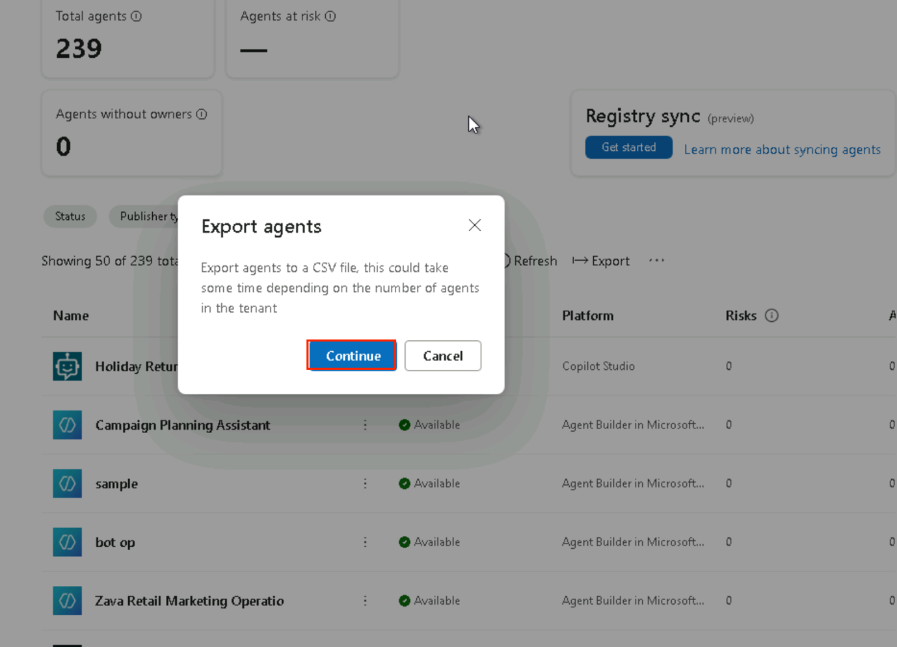

3.  Open the downloaded CSV file.

4.  Confirm that the file contains rows for Project Knowledge Assistant,
    Frontline Operations Assistant, HR & Payroll Assistant, and Holiday
    Returns Helper.

5.  Confirm that the following columns are present: agent name,
    publisher, creator, creation date, host products, and availability
    status.

    

6.  Close the CSV file.

## Exercise 6: Identify Ownerless Agents

Use the Registry's ownerless filter to check whether any of Zava
Retail's three agents lack a business owner, and understand what that
gap would mean for accountability. Sam Torres already owns Frontline
Operations Assistant, but Holiday Returns Helper should be assigned to
Priya Nair — confirm whether that assignment has taken effect.

1.  On the Registry tab, select the Missing an owner card.

2.  Review the list of agents that are displayed after applying the
    ownerless filter.

    

Note whether any of the three Zava agents appear in this filtered
list. In a lab environment where agents were created by the
Administrator, the agents may or may not appear as ownerless depending
on how ownership is propagated from Copilot Studio. If no agents
appear, this confirms that ownership was correctly assigned during
creation. If agents appear, this represents a governance gap that
would be addressed by reassigning ownership.

## Summary

In this lab, you created and published a new agent in Microsoft Copilot
Studio, explored the Agent 365 Overview to monitor tenant-wide agent
activity, and used the Agent Registry to review, approve, and publish an
agent for organizational use. You also installed the agent in Microsoft
Teams, validated its responses, practiced blocking and unblocking an
agent, exported the agent inventory for reporting, and identified
potential ownership gaps. These tasks demonstrated the core capabilities
of Agent 365 for governing, monitoring, and managing AI agents across an
organization.
