# Lab 09: Optimize financial analysis and reporting for Zava Retail finance operations with Microsoft 365 Copilot

## Estimated Duration : 40 minutes

## Overview

In this lab, you will explore how **Microsoft 365 Copilot** transforms finance workflows by providing AI-powered assistance across **Microsoft Excel**, **Microsoft Teams**, and **Copilot Chat**. Instead of manually analyzing spreadsheets, documenting meetings, and preparing executive reports, you will use Copilot to accelerate financial analysis, improve collaboration, and generate decision-ready business insights.

You will analyze Cost of Goods Sold (COGS) data for Zava Retail's new product line using Copilot in Excel, summarize finance meetings and generate follow-up actions in Microsoft Teams, and use Copilot Chat to evaluate a potential acquisition through structured financial, operational, and integration analysis. By the end of the lab, you will understand how Microsoft 365 Copilot helps finance professionals reduce manual effort, improve reporting quality, and support faster, data-driven business decisions.

## Lab objectives 

In this lab, you will perform the following:

- Exercise 1: Analyze product Cost of Goods Sold (COGS) data using Microsoft Copilot in Excel.
- Exercise 2: Summarize finance meetings, generate action items, and create follow-up communications using Microsoft Teams and Copilot.
- Exercise 3: Evaluate a potential business acquisition using Microsoft Copilot Chat by generating executive summaries, financial analysis, and integration recommendations.

## Scenario

Zava Retail's Finance department is responsible for supporting strategic business decisions through accurate financial analysis, executive reporting, and cross-functional collaboration. As the organization prepares to launch a new product line while simultaneously evaluating a potential acquisition, finance teams must analyze large datasets, capture key decisions from stakeholder meetings, coordinate follow-up activities, and present complex financial information in a format suitable for executive leadership.

To improve productivity and accelerate decision-making, Zava Retail has adopted Microsoft 365 Copilot across its finance operations. By integrating AI assistance directly into Excel, Teams, and Copilot Chat, finance professionals can quickly analyze financial data, automate meeting summaries, generate task assignments and communications, and create comprehensive acquisition reports that enable leadership to make informed business decisions with greater confidence.

**Key Personas**

1. **Financial Analyst (You)** : Leads financial analysis, reporting, forecasting, and strategic business evaluations while supporting executive decision-making across the organization.

1. **Robin Kline - Finance Manager** : Provides financial direction, reviews business performance, and oversees strategic initiatives, including new product launches and acquisition planning.

1. **Amari Rivera - Finance Team Member** : Supports operational finance activities by contributing analysis, validating financial data, and completing assigned action items.

1. **Quincy Brooks - Finance Team Member** : Assists with financial planning, budgeting, and cross-functional collaboration to ensure timely completion of finance initiatives.

1. **Miguel Reyes - Finance Team Member** : Coordinates financial analysis across departments and supports reporting, forecasting, and acquisition assessments.

1. **Eric Solomon - Finance Team Member** : Supports financial governance, compliance, reporting activities, and follow-up actions arising from finance meetings.

1. **Executive Leadership Team** : Reviews Copilot-generated financial insights, acquisition analyses, and strategic recommendations to guide business planning and investment decisions.

## Exercise 1: Use Copilot in Excel to Analyze New Product Line COGS

The Finance team is finalizing Cost of Goods Sold (COGS) estimates for Zava Retail's new Zava Home product line. As the team's lead financial analyst, you are tasked with verifying the latest COGS data provided by the Merchandising team and ensuring leadership can easily review the most relevant numbers.

### Task 1: Understanding Copilot in Excel

1. Open web browser and navigate to Excel using the URL provided and click **Sign in** button.

   ```
   https://excel.cloud.microsoft/
   ```
   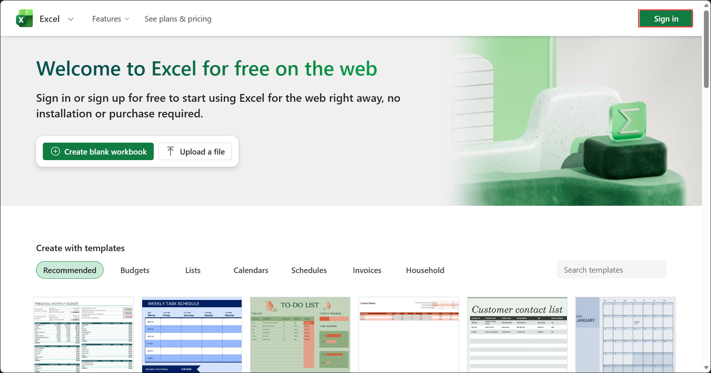

1. Sign in with following  credentials:

	- **Email/Username:** **<inject key="AzureAdUserEmail"></inject>**

    

	- **Temporary Acces Password:** **<inject key="AzureAdUserPassword"></inject>**

    

1. If **Action required** pop-up window appears, click on **Ask later**.

1. If prompted to **stay signed in**, you can click **No**.

    


1. Click **Upload a file** to upload your files.

   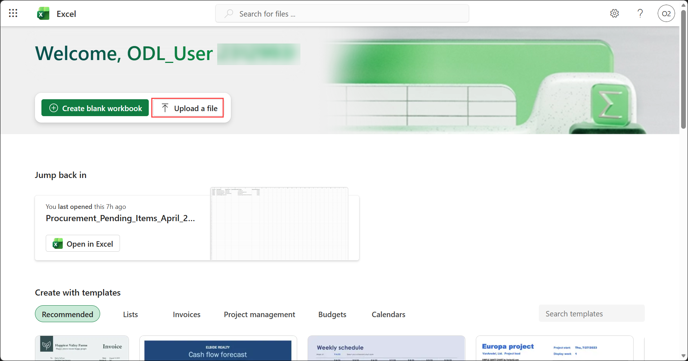
   
1. Navigate to **C:\Labfiles\Lab7-Lab files** and open the **Zava Home COGS Estimates.xlsx** file.
   
    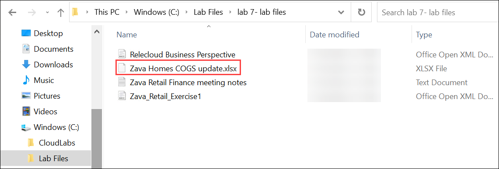

    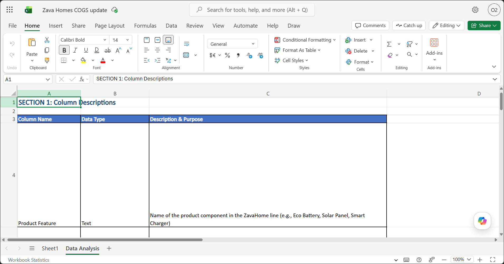

1. Select the Copilot icon to open Copilot chat.
   
    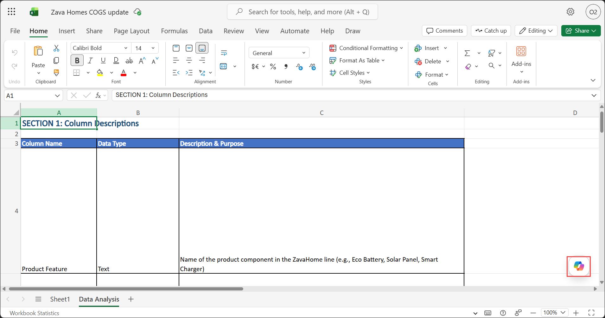

1. To analyze the dataset, paste the prompt below and select **Send** button:
    
    ```
    I'm a financial analyst for Zava Retail. I was asked to analyze the Zava Home COGS Estimates spreadsheet for Zava Retail's new Zava Home product line. Can you please review the dataset in this spreadsheet and provide two things in a new sheet: (1) a clear description of each key column and its purpose, and (2) a list of any missing inconsistent data points that could affect accuracy. Present your findings in a concise, structured format in a new sheet.
    ```
    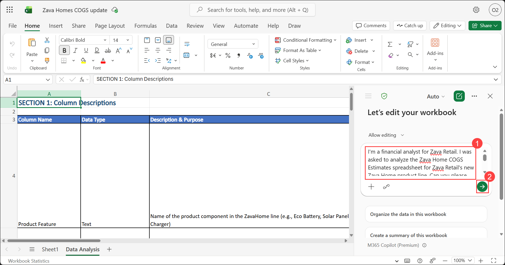

1. Review the output:
   
    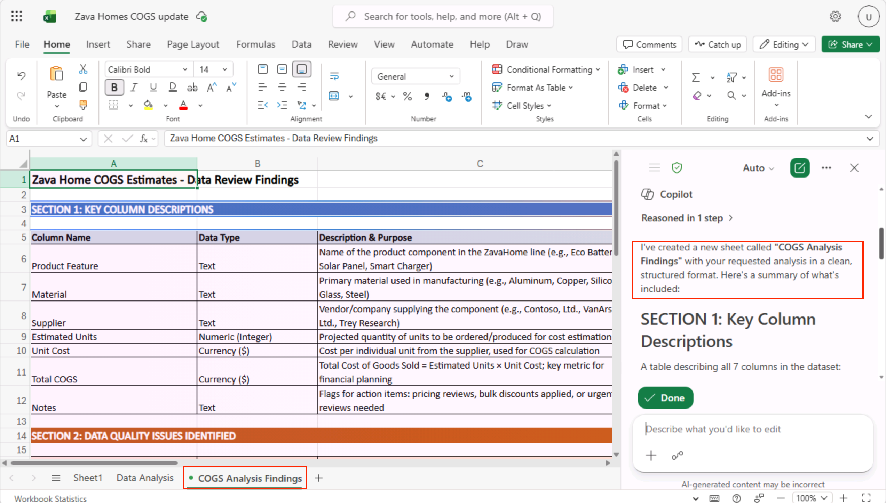

     > Note: Generated outputs are non-deterministic and may vary across users, sessions, and environments.
    
## Exercise 2: Use Copilot in Teams to Summarize Meeting Notes

In your role as a Financial Analyst for Zava Retail, you joined a
meeting with Robin Kline, Zava Retail's Finance Manager, and other
Finance department members including Amari Rivera, Quincy Brooks, Miguel Reyes, and Eric Solomon. You didn't have time to take detailed notes, so you turned to Copilot for help.

### Task 1: Summarize Meeting Notes

1. Navigate to Microsoft 365 Copilot using the URL.
     ```
     https://m365.cloud.microsoft/
     ```

    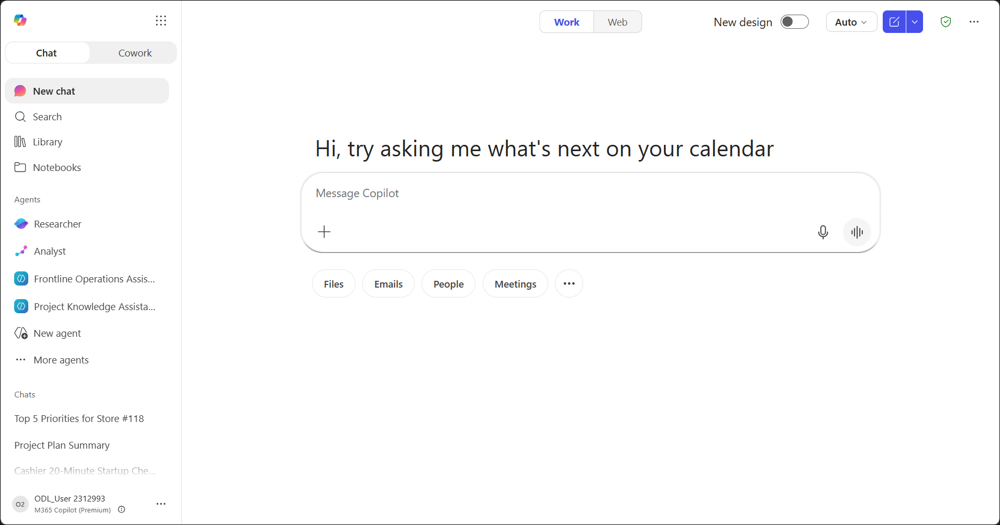

1. Click the **app launcher (1)** icon, then select **Teams (2)**.
   
    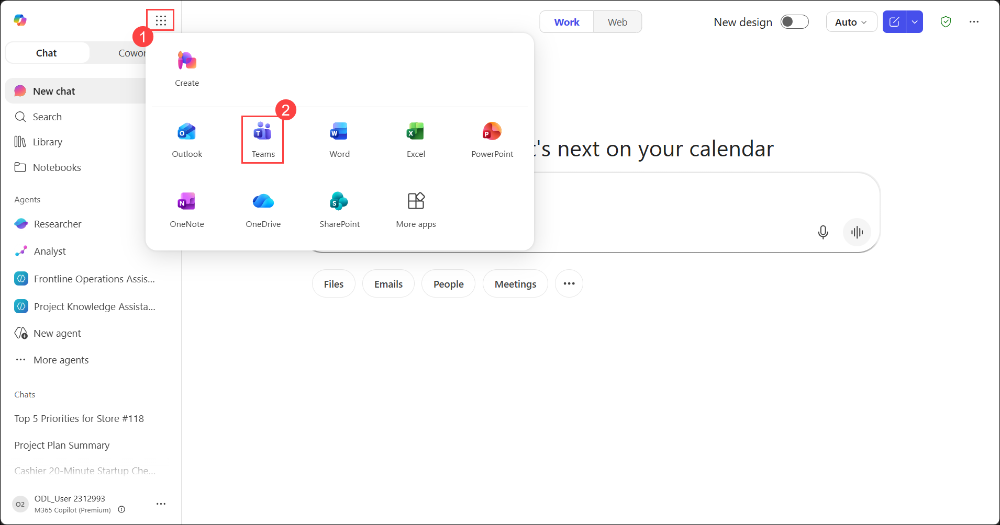

1. Click the **Copilot (1)** icon in the left navigation bar and open a **new chat**, enter a prompt **(2)**, then click the **Send (3)** button.

   ```
   Generate a downloadable summary. Review the summary to ensure it includes decisions, next steps, and responsibilities. Ask Copilot to generate a downloadable file for distribution to the meeting participants. Download the document that Copilot generated
   ```

    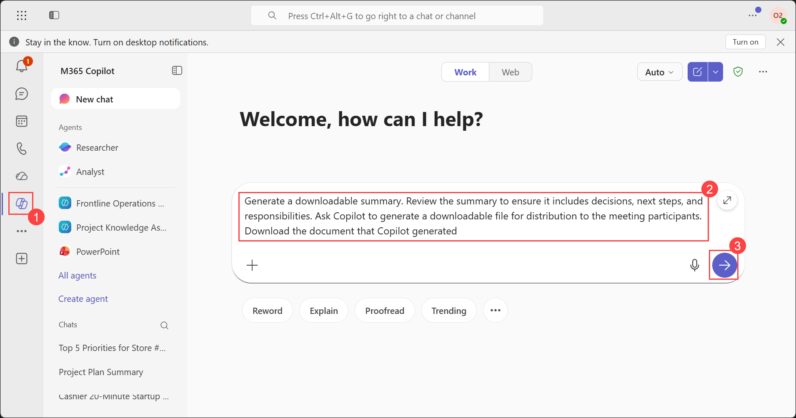

1. Review the output: 

    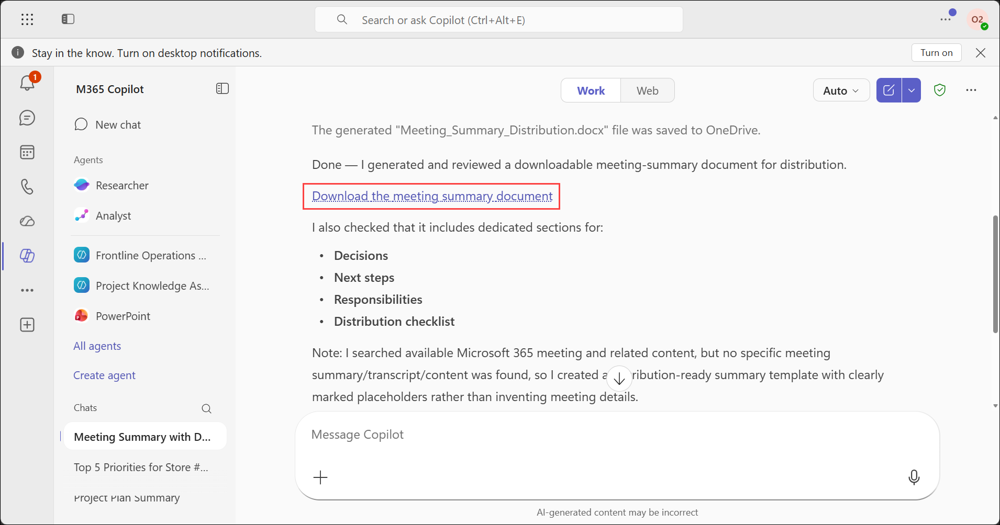

     > Note: Generated outputs are non-deterministic and may vary across users, sessions, and environments.

### Task 2: Creating a Task List

After reviewing the next steps in the report summary, ask Copilot to
generate a detailed task list for each participant based on the action items in the notes.

1. To generate a task list, paste the below prompt in the description box and select **Send** icon.  

    ```
    Review the meeting summary and Based on the action items and next steps in the meeting summary,create a detailed task list for each participant. Assign responsibilities clearly and include suggested deadlines or priority levels for each task, such as high, medium, or low priority where appropriate
    ```

    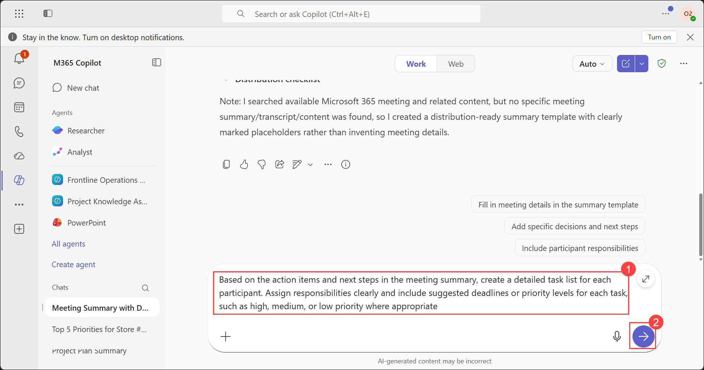

1. Review the output:  

    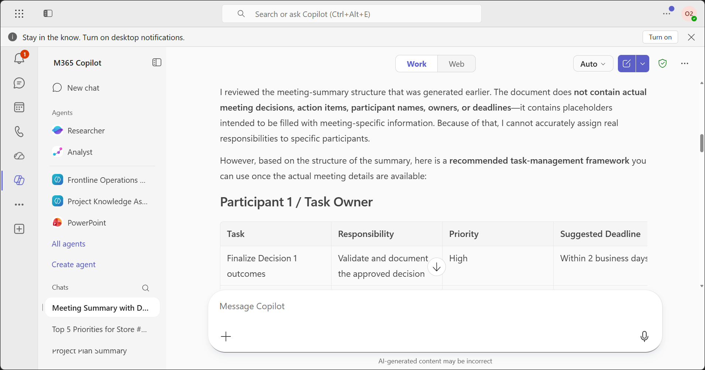
     
     > Note: Generated outputs are non-deterministic and may vary across users, sessions, and environments.

### Task 3: Generate a Calendar Invite

In follow-up to the timeline, ask Copilot to draft a calendar invite for the team to reconvene.

1. To generate a calendar, paste the below prompt in the description box and select the **Send** icon.  

      ```
      Draft a follow-up email to the team summarizing the meeting outcomes and including the assigned task list with responsibilities, deadlines, and priority levels for each participant.
      ```

    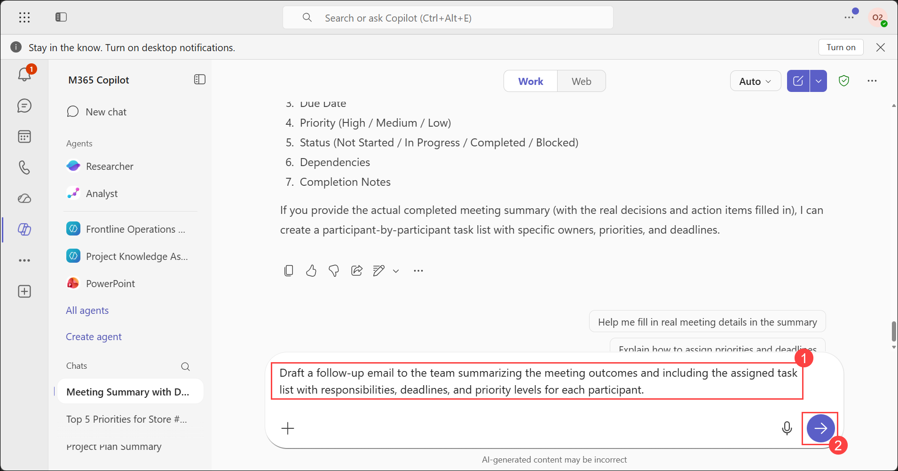
    
1. Review the output:

    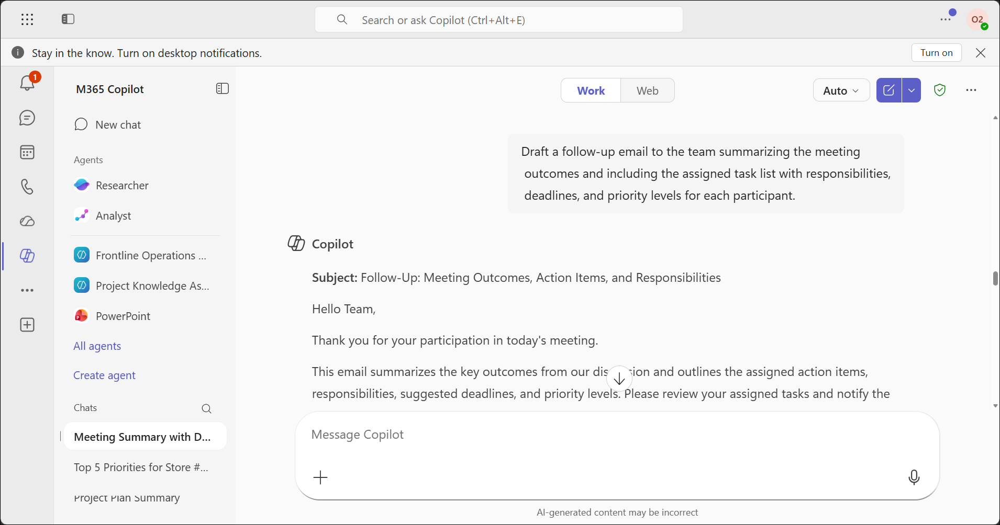

    >Note: Generated outputs are non-deterministic and may vary across users, sessions, and environments.

## Exercise 3: Use Copilot Chat to Analyze a Potential Acquisition

Zava Retail's executive team is evaluating the potential acquisition of Relecloud, Ltd. Robin Kline, Zava Retail's Finance Manager, sent you a detailed business perspective for Relecloud that provides an overview of the company's market position, financial performance, customer and sales insights, operations and capabilities, intellectual property, product roadmap, risks and challenges, and future outlook.

This task demonstrates how Copilot Chat can extract, categorize, and
structure complex financial information into actionable summaries and how detailed prompts consistently produce more satisfactory results than high-level, vague ones.

### Task 1: Create a business perspective summary 

1. Navigate back to the Microsoft 365 Copilot home page and Click **New chat**.
    
1. Select the **+ icon** in the prompt field and then select **Upload images and files**.

    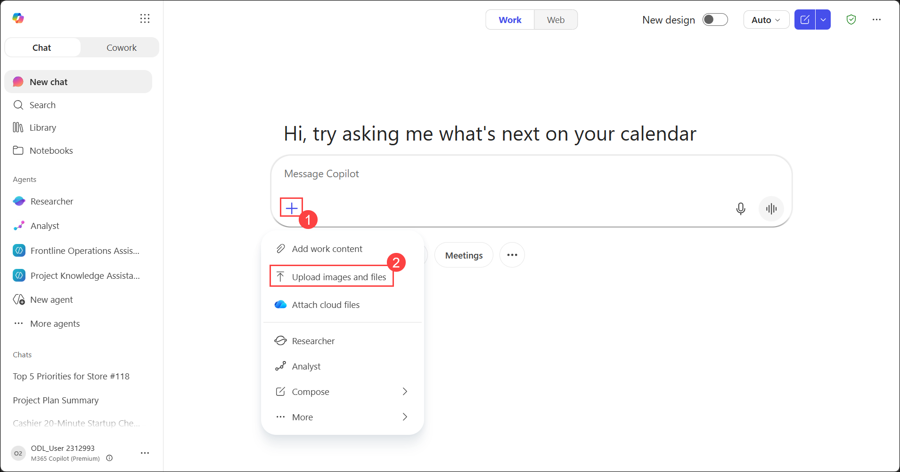

1. Select **Relecloud Business Perspective.docx** file from **C:\Labfiles\Lab7-Lab files**.

   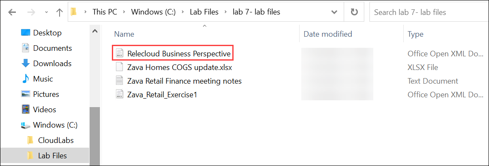

1. Paste the following prompt in the prompt field and selec **Send** button to execute the prompt.
    
      ```
      Review the attached Relecloud Business Perspective document and create a business perspective summary with the following three sections:
      (1) Relecloud’s financial data, 
      (2) Operations analysis of Relecloud,
      (3) Integration plan for the acquisition. 
      Present the summary in a clear and structured executive format suitable for leadership review.
      ```

    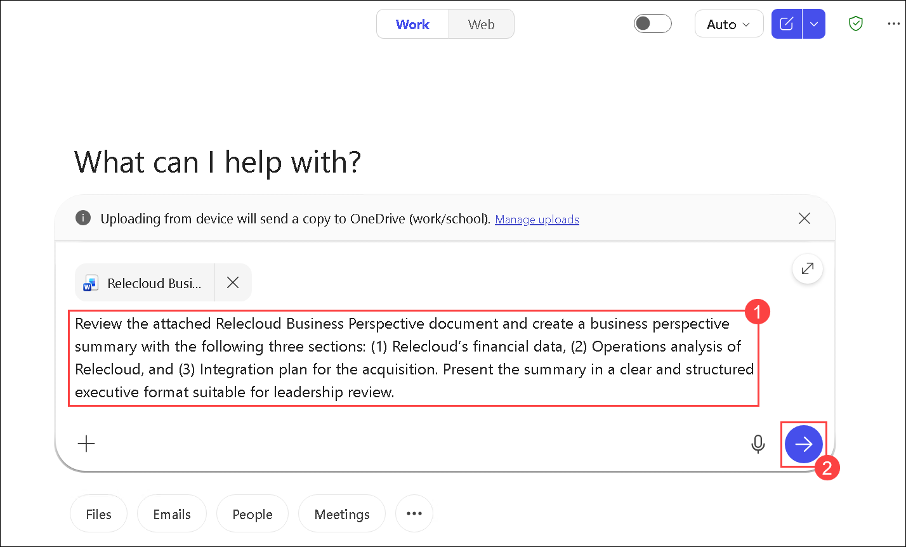      

1. Review the output:

    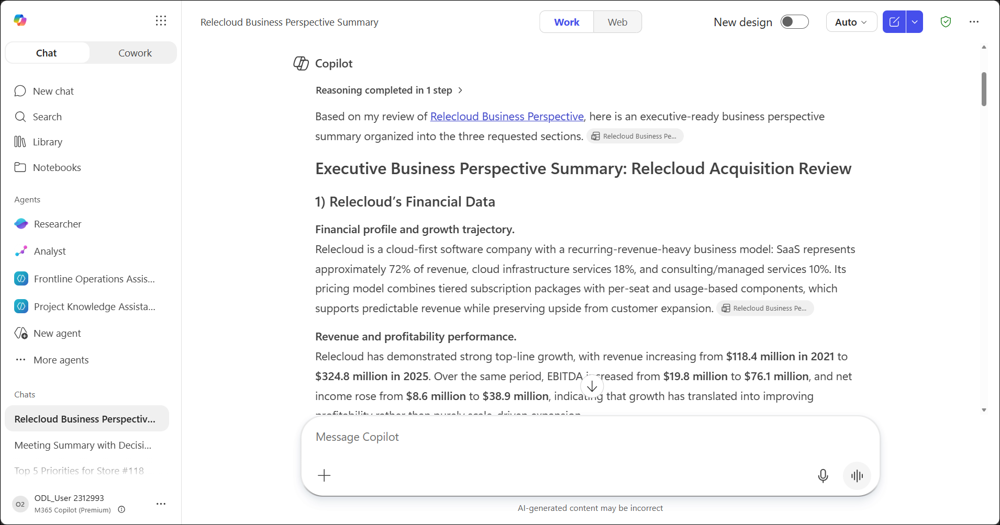   

### Task 2: Expand the Summary and generate a comprehensive report

After reviewing the initial summary, ask Copilot to generate a more
comprehensive version of the report with deeper analysis and visuals.  
  
1. In the Copilot prompt field, paste the following prompt and select the **Send** button.

    ```
    Expand the previous Relecloud acquisition report and include all prior information, plus the following additional analysis:
  
    1.  Financial Analysis Section:
  
    - Valuation and deal structure, including valuation multiples and deal structure implications
  
    - Financial health and ratios, including liquidity, solvency profitability trends, gross-to-net retention by cohort, regional ARR dynamics, and cash flow analysis
  
    - Revenue and customer concentration, including revenue breakdown,concentration risks by customer and sector, churn drivers, and retention trends
  
    - Include line or bar charts showing revenue, EBITDA, net income, gross margin, and operating margin trends over time
  
    2.  Operations Analysis Section:
  
    - Cost structure and efficiency, including COGS, OpEx, efficiency metrics, and scalability assessment
  
    - Competitive positioning, including SWOT analysis and peer benchmarking
  
    - Include a SWOT Matrix visual summarizing strengths, weaknesses opportunities, and threats
  
    - Include a Scalability Assessment Diagram illustrating DevSecOps maturity, infrastructure readiness, and organizational scalability.
  
    3.  Integration Planning Section:
  
    - Synergy and integration modeling, including synergy realization opportunities, integration risks, and post-merger integration planning
  
    - Leadership and organizational review, including management track record and organizational structure assessment
  
    - Include an Integration Timeline (Gantt Chart) showing phases and milestones for post-merger integration
  
    - Format the report as a detailed executive acquisition analysis suitable for finance leadership decision-making
    ```
  
    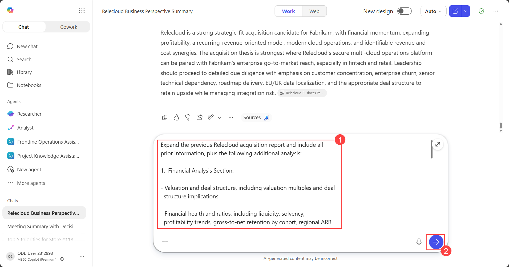   

1. Review the output:

    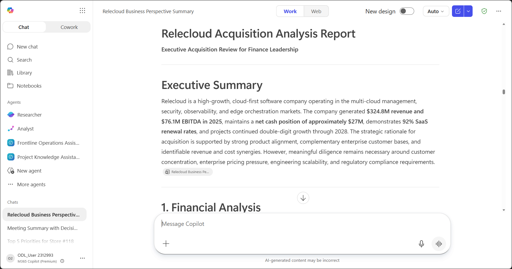

## Summary

In this lab, you completed the following:

- Used Microsoft Copilot in Excel to analyze Cost of Goods Sold (COGS) data for Zava Retail's new product line, identify data quality issues, and generate structured financial insights.
- Leveraged Microsoft Teams and Copilot to summarize finance meetings, generate participant-specific task lists, and draft follow-up communications based on meeting outcomes.
- Used Microsoft Copilot Chat to analyze a potential acquisition by creating executive business summaries, expanding them into comprehensive financial and operational reports, and developing integration planning recommendations supported by visualizations.

By completing this lab, you learned how Microsoft 365 Copilot enhances finance operations by simplifying financial analysis, improving collaboration, automating documentation, and transforming complex business information into executive-ready insights that support faster and more informed strategic decision-making.

## You have successfully completed the Lab!

Now, click on **Next >>** from the lower right corner to move on to the next page.


