# Lab 11: Transform After-Sales Repair Operations at Zava Retail with an AI-Powered Declarative Agent

### Estimated Duration: 60 Minutes

## Overview

In this lab, you will build a **Declarative Agent** using a **TypeSpec** definition with the **Microsoft 365 Agents Toolkit**. You will create an agent called **RepairServiceAgent** that connects to an existing Repair Service API, enabling users to create, update, retrieve, and delete car repair records conversationally within Microsoft 365 Copilot.

Zava Retail is a global retail and service organization that provides after-sales support for automotive accessories and consumer electronics across multiple regional service centers. As the business scales, the After-Sales Operations team faces increasing complexity in managing repair requests, tracking service status, and coordinating across technicians and service locations. Repair operations today rely on a legacy tracking system and manual API interactions, causing delays and inconsistent data updates. The RepairServiceAgent modernizes this workflow by giving service agents, technicians, and managers a single conversational interface - backed by TypeSpec-defined API actions and Adaptive Card responses - for managing repair data inside Microsoft 365 Copilot.

**Declarative agents** are a type of agent for Microsoft 365, built by extending Microsoft 365 Copilot. You define custom knowledge and custom actions to create agents tailored to a specific scenario. Declarative agents use the same infrastructure, orchestrator, foundation model, and security controls as Microsoft 365 Copilot, ensuring a consistent and familiar user experience.

Declarative agent architecture diagram. At the very basis there is the foundational model of Microsoft 365 Copilot, as well as the same orchestrator. The agent provides also custom knowledge and grounding data, and custom skills as actions, triggers, and workflows.. The user experience is available in Microsoft 365 Copilot.

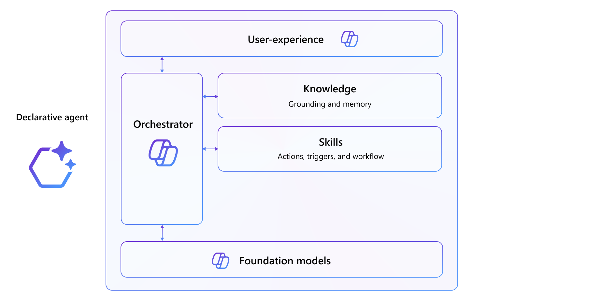

**TypeSpec** is a language developed by Microsoft for designing and describing API contracts in a structured and type-safe way - a blueprint for how an API should look and behave, including what data it accepts, returns, and how its parts connect. TypeSpec brings the same structure to agents and their API actions that TypeScript brings to frontend/backend code, fitting naturally into design-first workflows with tools like Visual Studio Code. It provides a single source of truth for agent behavior, keeps actions and capabilities consistent, auto-generates OpenAPI specs and manifests, and catches design issues (mismatched types, unclear definitions) before implementation begins.

## Lab Objectives

In this lab, you will perform the following:

- Exercise 1: Build the base agent with TypeSpec using Microsoft 365 Agents Toolkit
  - Task 1: Scaffold your base agent project using Microsoft 365 Agents Toolkit
  - Task 2: Define your agent
  - Task 3: Update the action for the agent
  - Task 4: (Read only) Understand the decorators
  - Task 5: Test your agent
- Exercise 2: Enhance Agent capabilities
  - Task 1: Modify agent to add more operations
  - Task 2: Add adaptive card to function reference
  - Task 3: Update agent instruction for new operations
  - Task 4: Provision and Test the Agent

## Exercise 1: Build the base agent with TypeSpec using Microsoft 365 Agents Toolkit

In this exercise, you will build a **Declarative Agent**, define it, update the actions, and test the agent.

### Task 1: Scaffold your base agent project using Microsoft 365 Agents Toolkit

In this task, you will scaffold a new Declarative Agent project using the Microsoft 365 Agents Toolkit in Visual Studio Code.

1. Right click and create a new folder named **ServiceAgent** in your Desktop.

    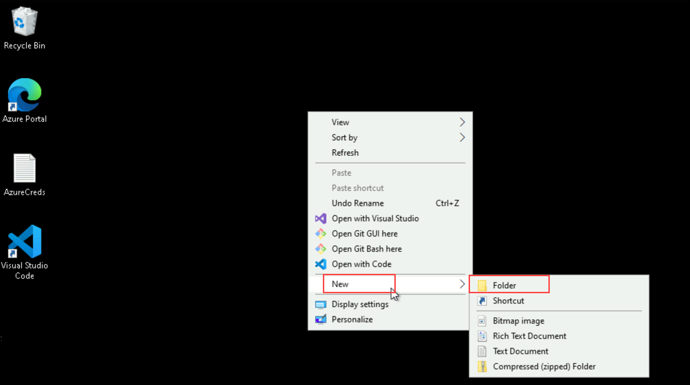

    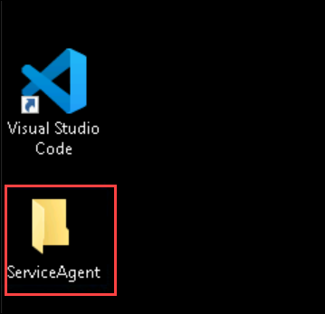

4. Locate the **Microsoft 365 Agents Toolkit icon** from the menu on the left and select it. An activity bar will open. Select the **Create a New Agent/App** button in the activity bar, which will open the palette with a list of app templates available on Microsoft 365 Agents Toolkit.

    

    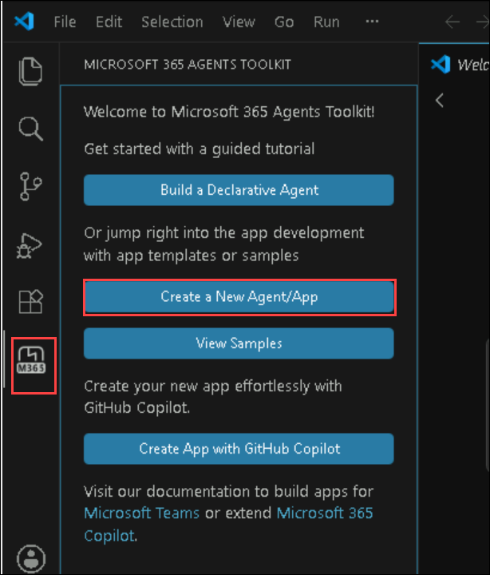

5. Choose **Declarative Agent** from the list of templates.

    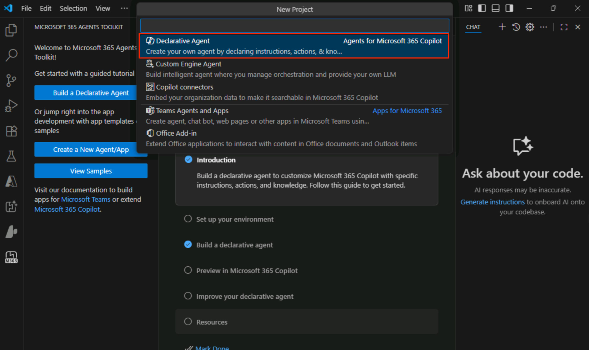

6. Next, select **Start with TypeSpec for Microsoft 365 Copilot** to define your agent using TypeSpec.

    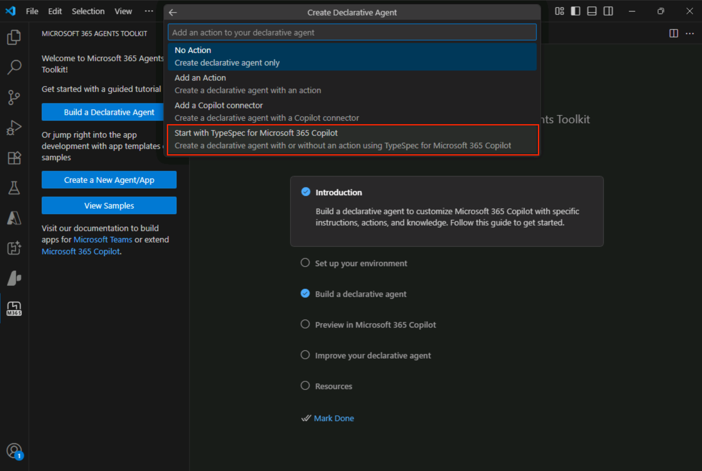

7. Next, select **Browse** and then select the folder **ServiceAgent** from the Desktop. This is the location where you want the Agents Toolkit to scaffold the agent project.

    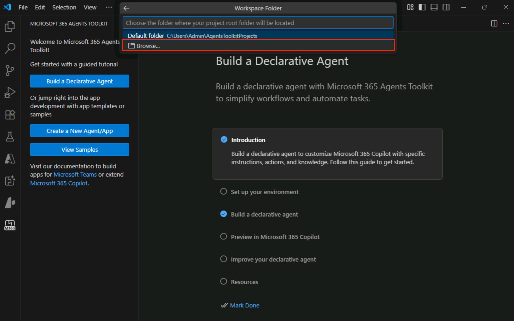

    

8. Next, enter the application name as **RepairServiceAgent** and select **Enter** to complete the process. You will get a new VS Code window with the agent project preloaded.

    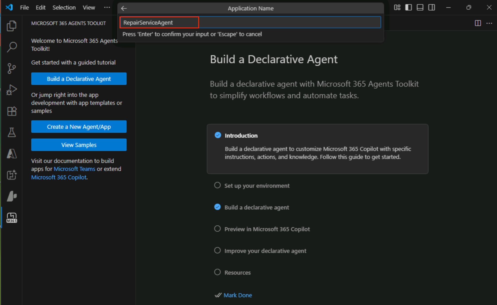

<!---
9. Select **Yes, I trust the authors** option in the confirmation dialog.

    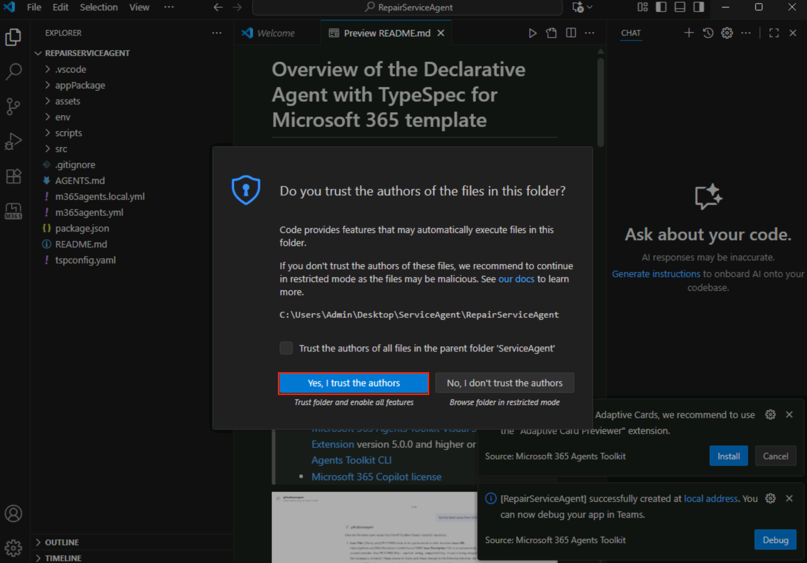


    >**Note:** If you get the Foundry MCP pop-up again, click **Allow** and then select your current username.

    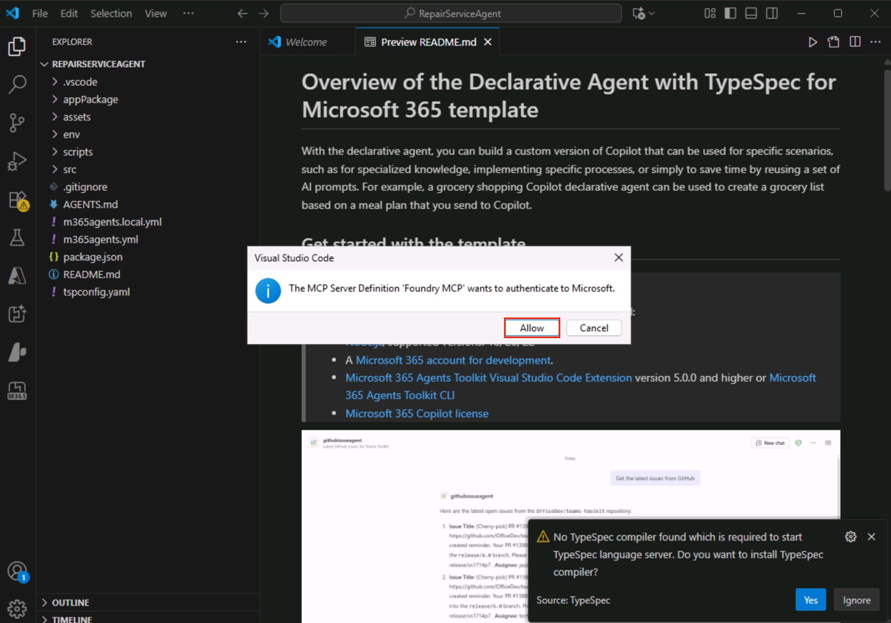
    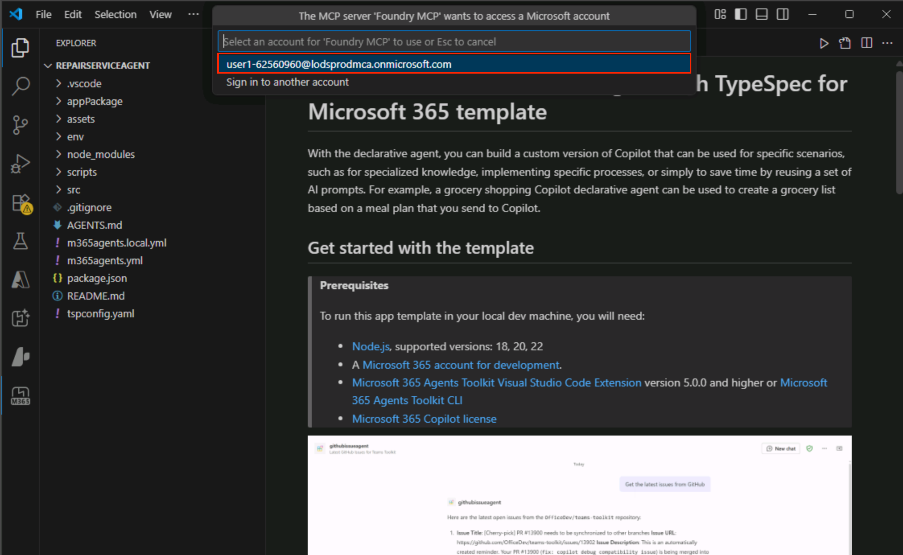
--->

10. You'll need to sign into the **Microsoft 365 Agents Toolkit** in order to upload and test your agent from within it.

11. Within the project window, select the **Microsoft 365 Agents Toolkit icon** again from the left side menu. This will open the Agent Toolkit's activity bar with sections like Accounts, Environment, Development, etc.

    

12. Under **Accounts** section, select **Sign in to Microsoft 365**.

    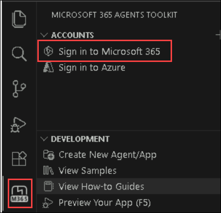

13. This will open a dialog from the editor to sign in, create a Microsoft 365 developer sandbox, or Cancel. Select **Sign in**.

    
<!---

14. Click **Allow** if you get a pop-up stating - Do you want to allow public and private networks to access this app?

    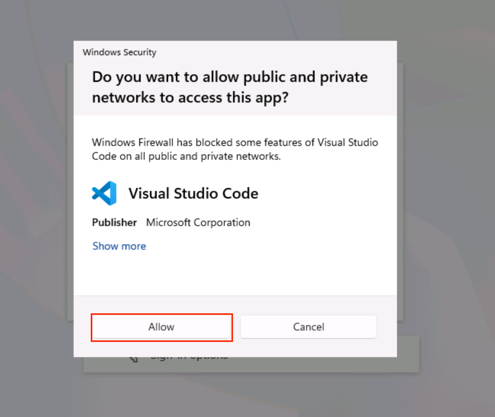

--->

1. On the **Sign in to Microsoft Azure** tab you will see the login screen, in that enter the following email/username, and click on **Next (2)**. 

   * **Email/Username**: <inject key="AzureAdUserEmail"></inject> **(1)**
   
      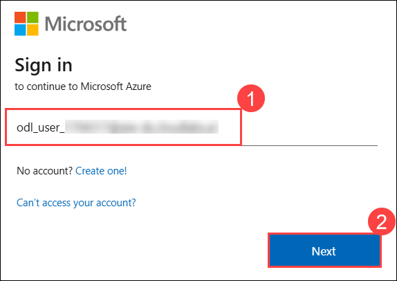
     
1. Now enter the following Temporary Access Pass and click on **Sign in (2)**.
   
   * **Temporary Access Pass**: <inject key="AzureAdUserPassword"></inject> **(1)**

      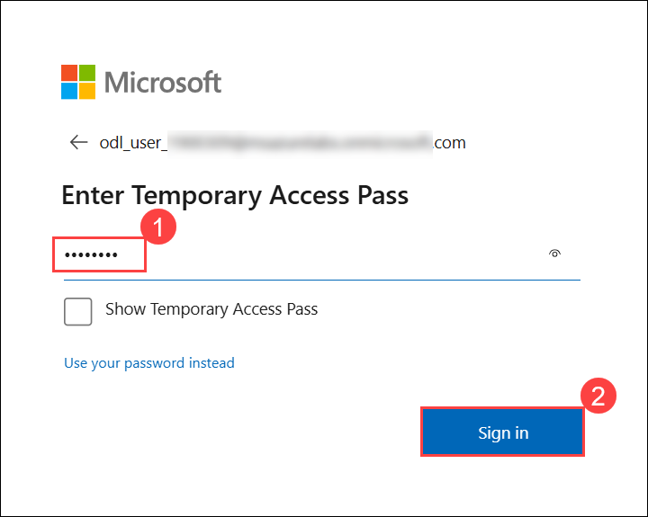 
     
1. If you see the pop-up **Stay Signed in?**, select **Yes**.

   

16. Once signed in, **close** the browser and go back to the project window.

    
    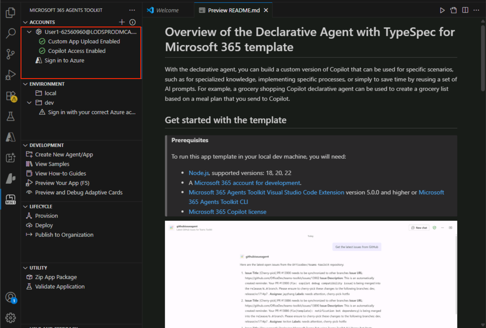

    >**Note:** If there is a message on Custom App Upload Disabled, safely ignore it.

1. Click on the Refresh option few times if its not connected.

    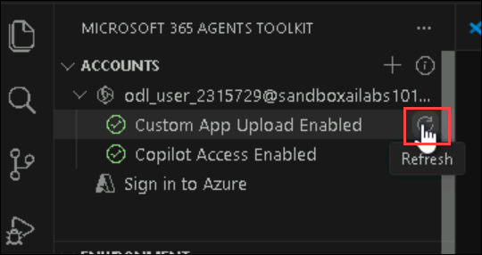

### Task 2: Define your agent

The Declarative Agent project scaffolded by the Agents Toolkit provides a template that includes code for connecting an agent to the GitHub API to display repository issues. In this lab, you'll build your own agent that integrates with a car repair service, supporting multiple operations to manage repair data. Before building an agent, first we will understand the structure of the project.

**Project Structure**

Within your agent project under the **src** folder, you'll discover the core TypeSpec configuration files: **main.tsp** and **env.tsp**.

The **main.tsp** file serves as the primary definition point for your agent, containing essential metadata, behavioral instructions, and capability specifications.

The **env.tsp** file is used by the toolkit to process environment variables during compilation. This file is generated from **env/.env.\*** files and offers variables for other TypeSpec files, so manual updates are not required.

You'll also find an **actions** folder containing template files - initially including **github.tsp**, which demonstrates GitHub API integration. For this lab, you'll replace this template with your own action definitions to establish connectivity with the Repairs API service.

Additionally, there's a **prompts** folder housing the **instructions.tsp** file, which allows you to define detailed behavioral instructions and guidance for your agent.

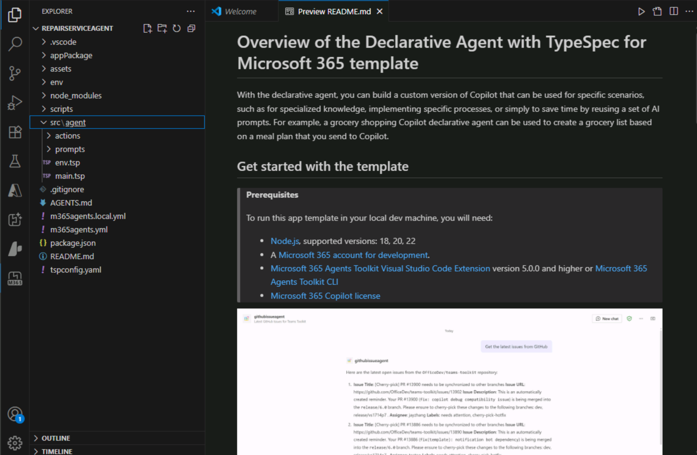

**Update the Agent Metadata and Instructions**

1. In the **src/main.tsp** file, you will find the basic structure of the agent. Review the content provided by the Agents Toolkit template, which includes:

    - **Agent name** and **description** 1️⃣
    - Basic **instructions** 2️⃣
    - Placeholder code for **actions** and **capabilities** (commented out) 3️⃣

    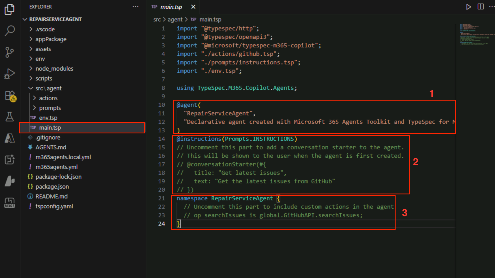

2. Begin by defining your agent for the repair scenario. Replace the **@agent** metadata with the below code snippet:

    ```
    @agent(
    "RepairServiceAgent",
    "An agent for managing repair information"
    )
    ```

    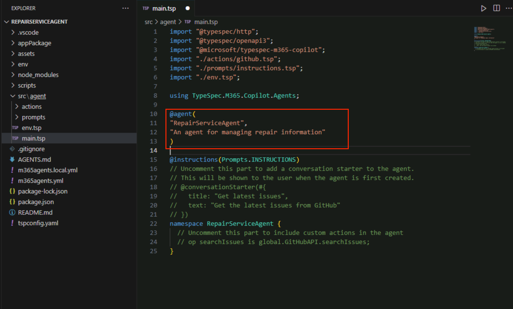

3. Next, configure a conversation starter - the initial prompt that begins user-agent interaction. Uncomment the default template section and update the title and text fields to match the agent scenario:

    ```
    // Uncomment this part to add a conversation starter to the agent.
    // This will be shown to the user when the agent is first created.
    @conversationStarter(#{
    title: "List repairs",
    text: "List all repairs"
    })
    ```

    This starter prompt needs to trigger a GET operation to retrieve all repairs from the service. To enable this behavior in the agent, you'll need to define the corresponding action, which is covered in Task 4.

    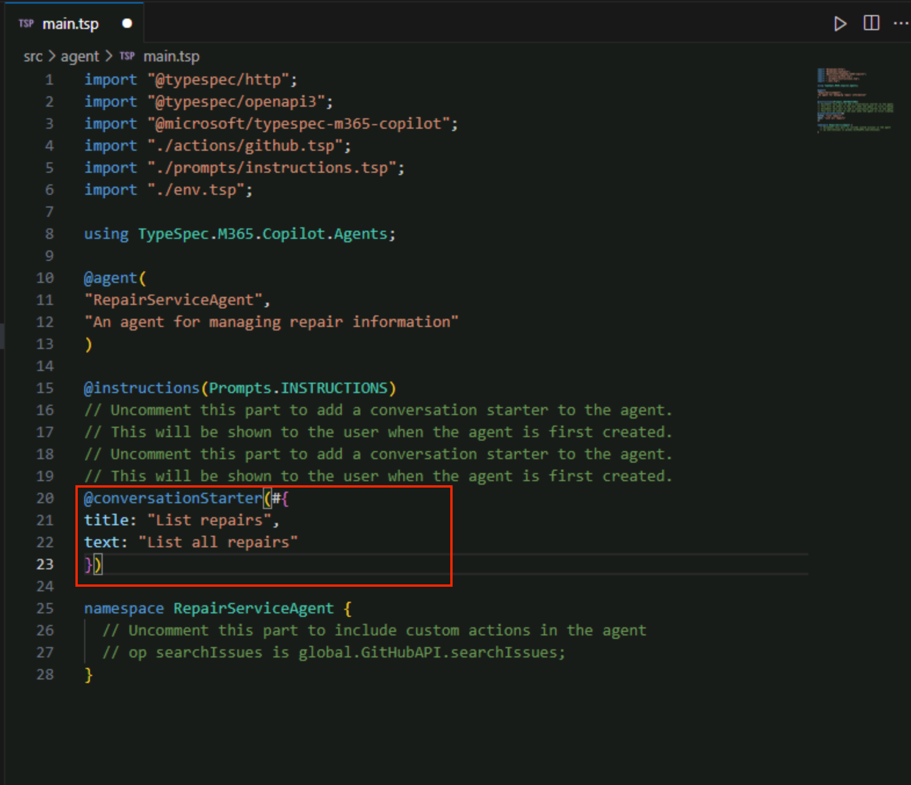

4. Next, go to **prompts/instructions.tsp** and update the instructions. Replace the entire code block in the file with the below code:

    ```
    namespace Prompts {
    const INSTRUCTIONS = """
        ## Purpose
        You will assist the user in finding car repair records based on the information provided by the user.
    """;
    }
    ```

    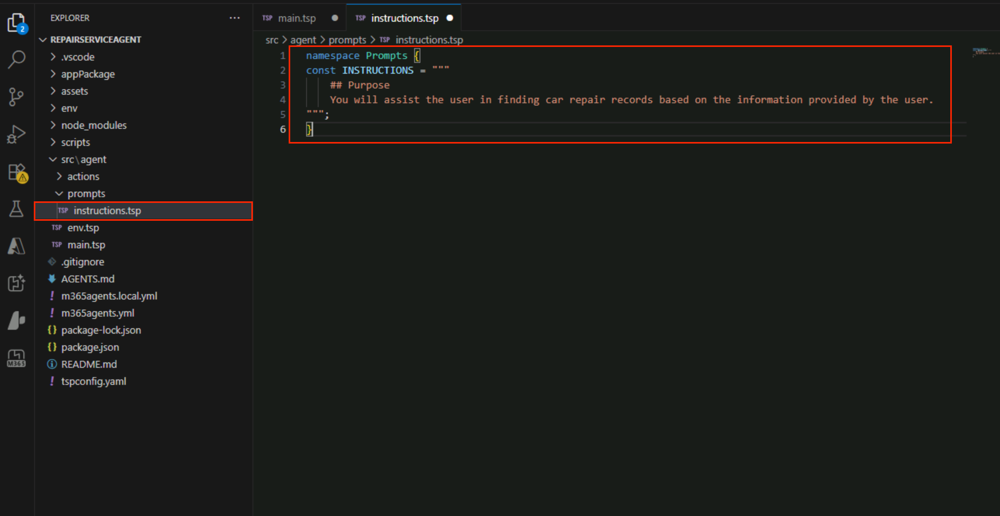

5. Save the changes to **both** files using **CTRL+S**.

### Task 3: Update the action for the agent

1. Next, you will define the action for your agent by opening the **src/agent/actions/github.tsp** file. Rename this file to **actions.tsp**.

    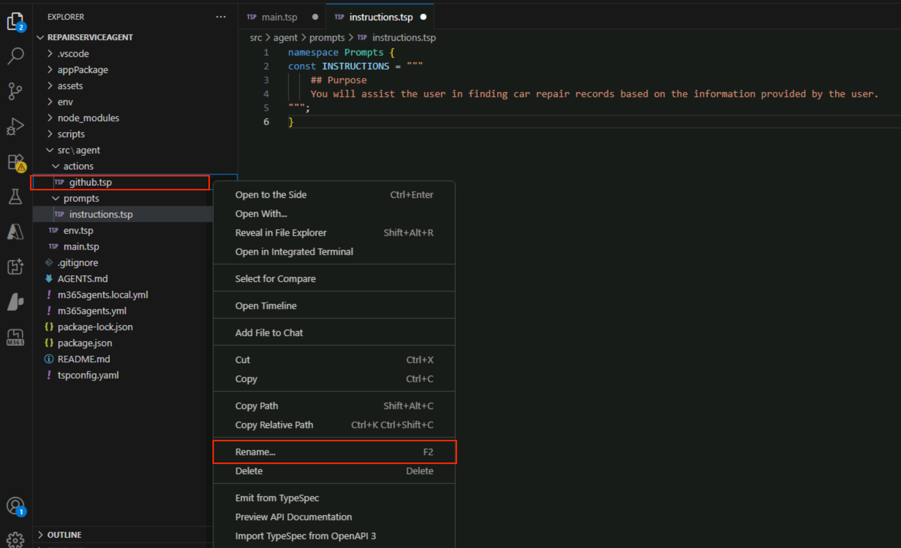
    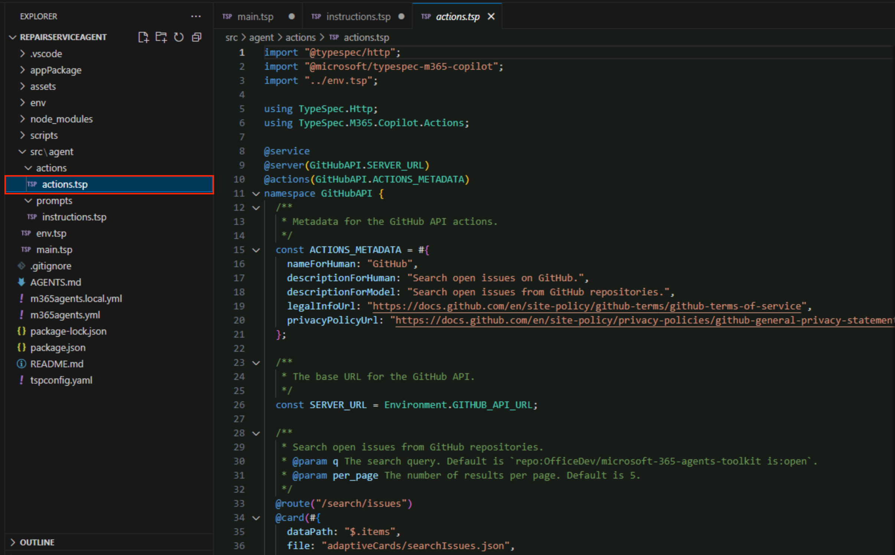

    You'll return to the **main.tsp** file later to complete the agent metadata with the action reference, but first, the action itself must be defined. For that, open the file **actions.tsp**.

    The default **actions.tsp** template demonstrates how to define an agent action, including metadata, service URL, and operation structure. Replace the sample GitHub logic entirely with definitions relevant to the Repairs API service.

2. After the module-level directives like import and using statements, replace the existing code up to the point where the "SERVER_URL" is defined with the snippet below:

    ```
    @service
    @server(RepairsAPI.SERVER_URL)
    @actions(RepairsAPI.ACTIONS_METADATA)
    namespace RepairsAPI{
    /**
    * Metadata for the API actions.
    */
    const ACTIONS_METADATA = #{
        nameForHuman: "Repair Service Agent",
        descriptionForHuman: "Manage your repairs and maintenance tasks.",
        descriptionForModel: "Plugin to add, update, remove, and view repair objects.",
        legalInfoUrl: "https://docs.github.com/en/site-policy/github-terms/github-terms-of-service",
        privacyPolicyUrl: "https://docs.github.com/en/site-policy/privacy-policies/github-general-privacy-statement"
    };

    /**
    * The base URL for the  API.
    */
    const SERVER_URL = "https://repairshub.azurewebsites.net";
    ```

    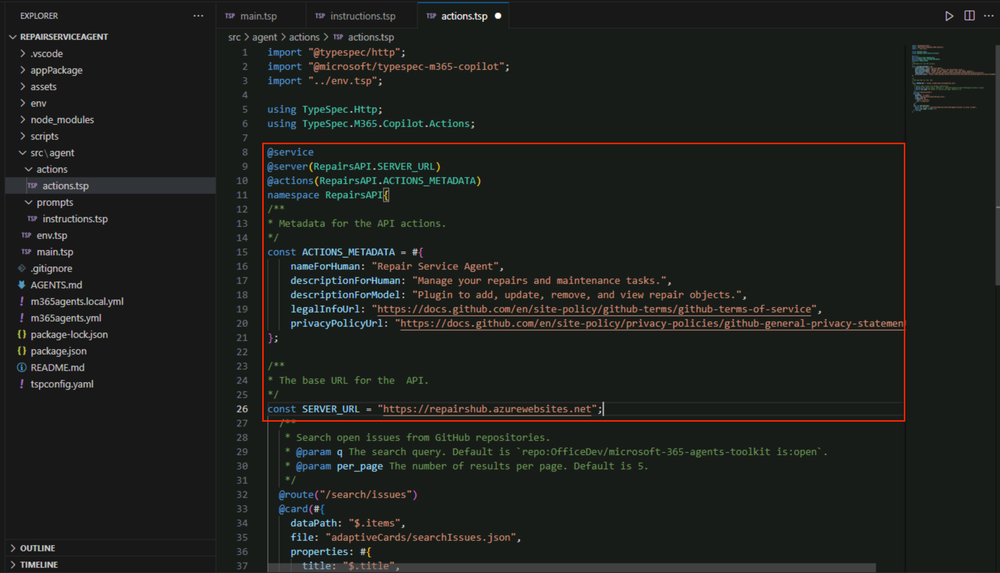

3. Next, replace the operation in the template code from searchIssues to **listRepairs**, which is a repair operation to get the list of **repairs**. Replace the entire block of code starting just after the SERVER_URL definition and ending *before* the final closing braces with the snippet below. Be sure to leave the closing braces intact. (Line numbers should be 27 to 45)

    ```
    /**
    * List repairs from the API 
    * @param assignedTo The user assigned to a repair item.
    */

    @route("/repairs")
    @get  op listRepairs(@query assignedTo?: string): string;
    ```

    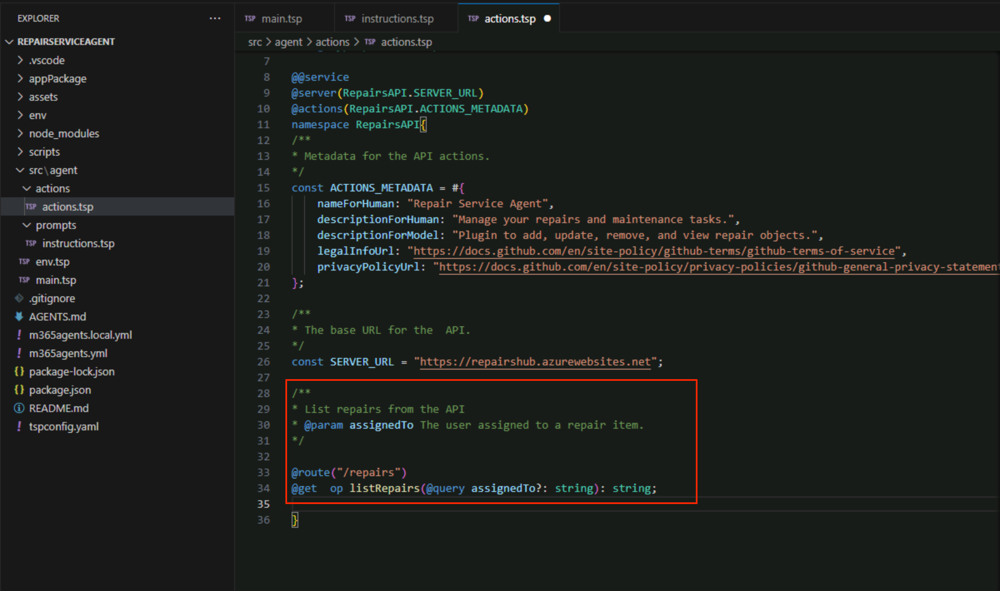

4. Now go back to the **main.tsp** file and verify the import statement for actions. If it still references *./actions/github.tsp*, replace *import "./actions/github.tsp";* with the statement below:

    ```
    import "./actions/actions.tsp";
    ```
    >**Note:** If it is done automatically, ignore this step.

    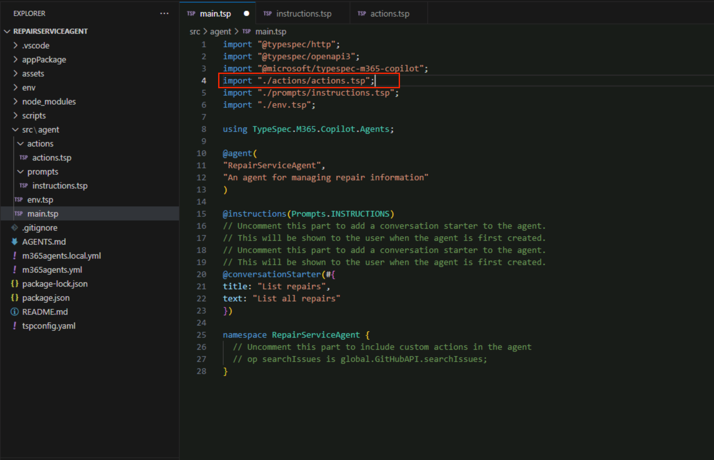

5. Next, in the same file, add the action you just defined into the agent. After the conversation starters, replace the entire "RepairServiceAgent" namespace with the below snippet:

    ```
    namespace RepairServiceAgent{  

        op listRepairs is global.RepairsAPI.listRepairs;   

    }
    ```

    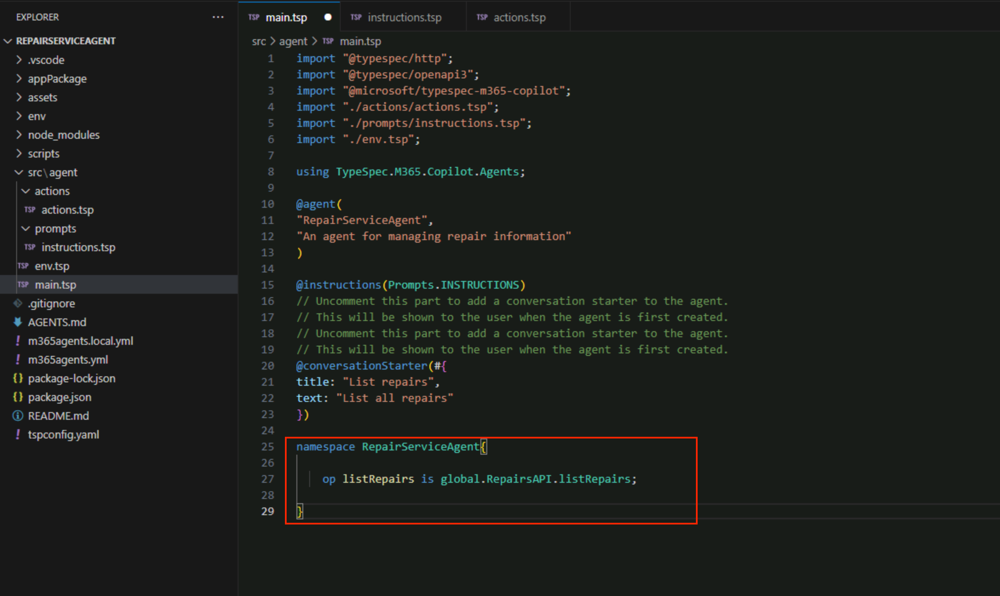

6. Save the files using **CTRL+S**.

### Task 4: (Read only) Understand the decorators

This is a task to understand what we have defined in the TypeSpec file. Just read through this task. In the TypeSpec files main.tsp and actions.tsp, you'll find decorators (starting with @), namespaces, models, and other definitions for your agent.

Check the below details to understand some of the decorators used in these files:

- **@agent** - Defines the namespace (name) and description of the agent
- **@instructions** - Defines the instructions that prescribe the behavior of the agent. 8,000 characters or less
- **@conversationStarter** - Defines conversation starters for the agent
- **op** - Defines any operation. Either it can be an operation to define agent's capabilities like op GraphicArt, op CodeInterpreter etc., or define API operations like op listRepairs
- **@server** - Defines the server endpoint of the API and its name
- **@capabilities** - When used inside a function, it defines simple adaptive cards with small definitions like a confirmation card for the operation

### Task 5: Test your agent

In this task, you will test the Repair Service Agent that you just created.

1. Select the **Agents Toolkit extension's** icon to open the activity bar from within your project.

2. In the activity bar of the Agents Toolkit, under **LifeCycle**, select **Provision**. This will build the app package consisting of the generated manifest files and icons, and side load the app into the catalog only for you to test.

    >**Alert:** If you reach a **Time-out Failure**, please re-start the provisioning cycle.

    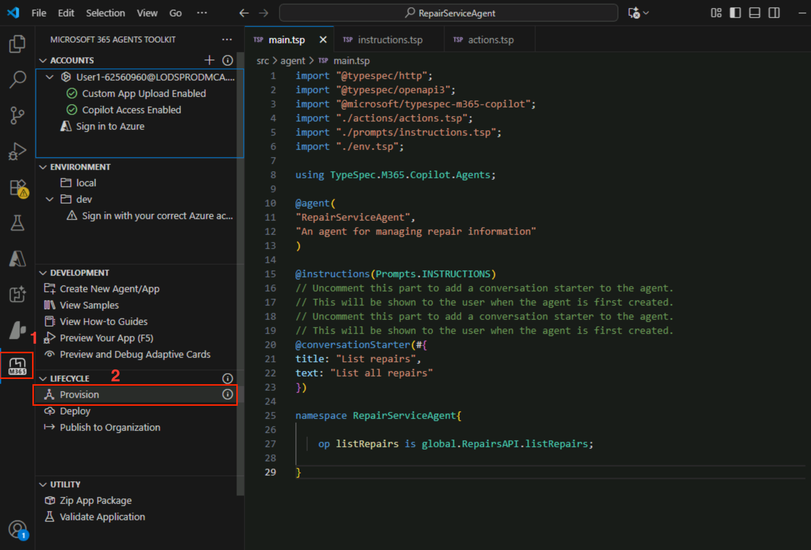

3. When you provision successfully, you will get output similar to below.

    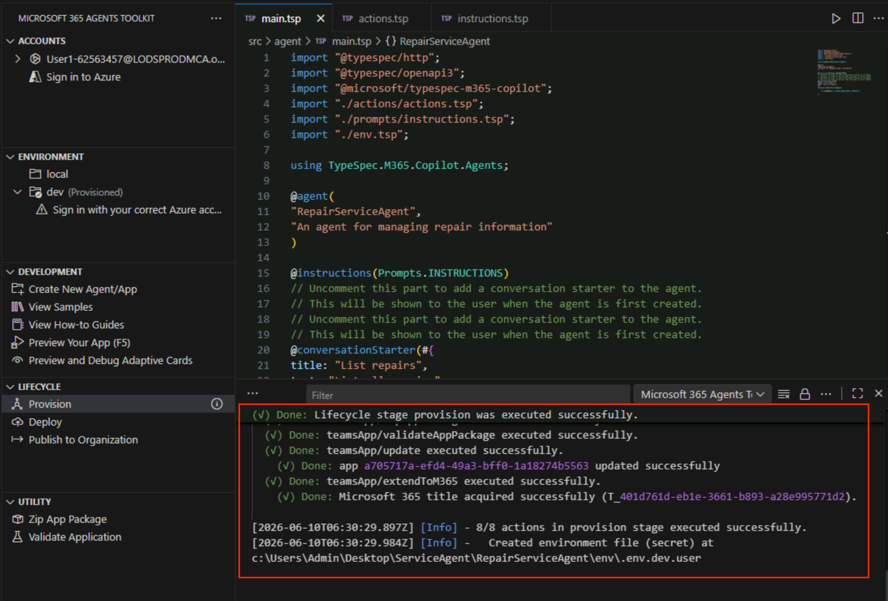

1. On your virtual machine, open a web browser and navigate to the Microsoft 365 Copilot portal.

     ```
     https://m365.cloud.microsoft/
     ```

    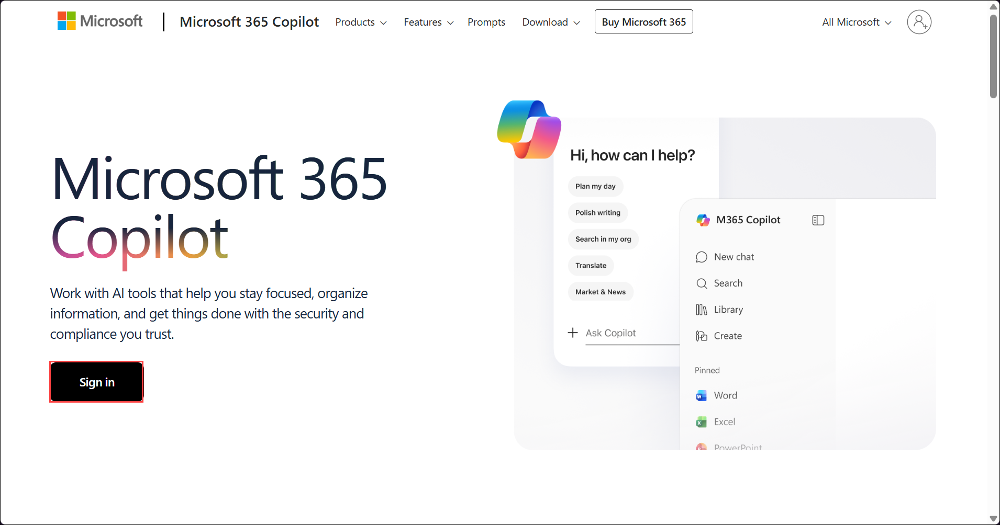

1. On the **Sign in** page, enter the following email/username and click **Next (2)**.

   * **Email/Username**: <inject key="AzureAdUserEmail"></inject> **(1)**
   
    
     
1. Now enter the following password and click on **Sign in (2)**.
   
   * **Password**: <inject key="AzureAdUserPassword"></inject> **(1)**
   
    

      > **Note:** If prompted to Enter Temporary Access Pass, enter the following **Password**: <inject key="AzureAdUserPassword"></inject> **(1)** and click on **Sign in (2)**.

       
     
1. If you see the pop-up **Stay Signed in?**, select **No**.

    

1. If you see the pop-up **You have free Azure Advisor recommendations!**, close the window to continue the lab.

1. If a **Welcome to Microsoft 365** popup window appears, select **Maybe Later** to skip the tour.

    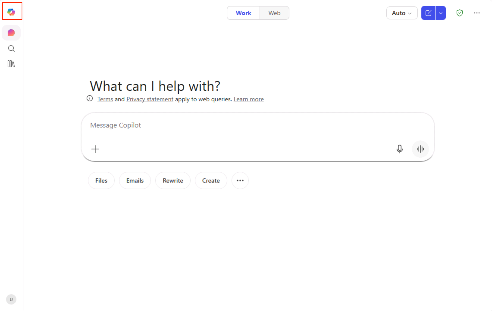

5. Select the **RepairServiceAgent** from the list of **Agents** available in the Microsoft 365 Copilot interface. This will take a while, and you will be able to see a toaster message showing the progress of the task to provision.

    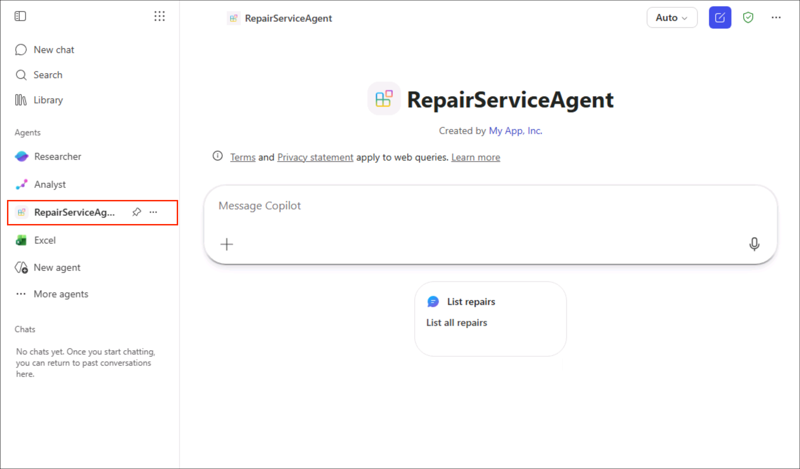

6. Select the conversation starter **List repairs** and send the prompt.

    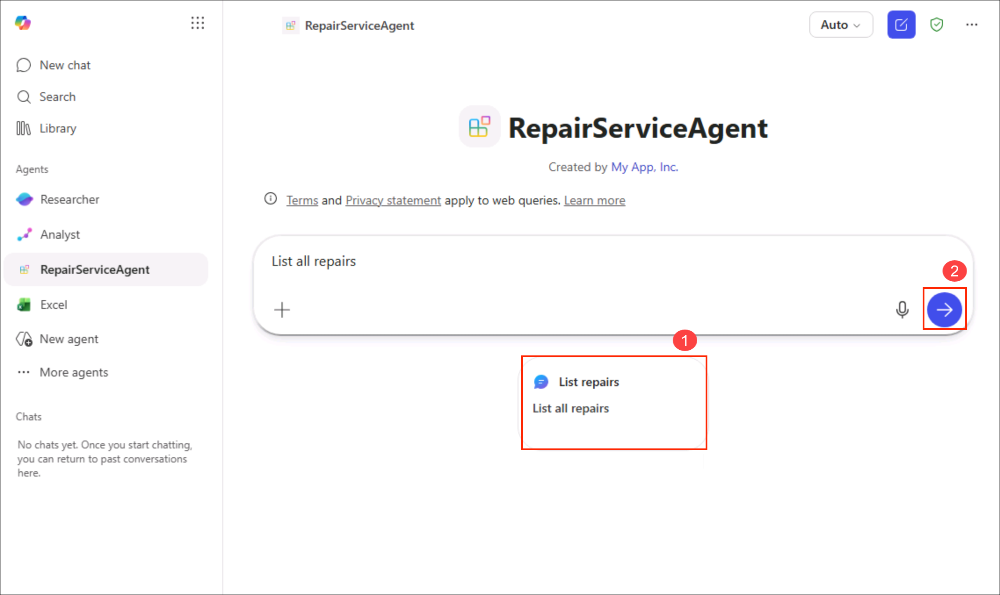

7. If there is a popup that asks for the connection to the API, select **Allow**.

    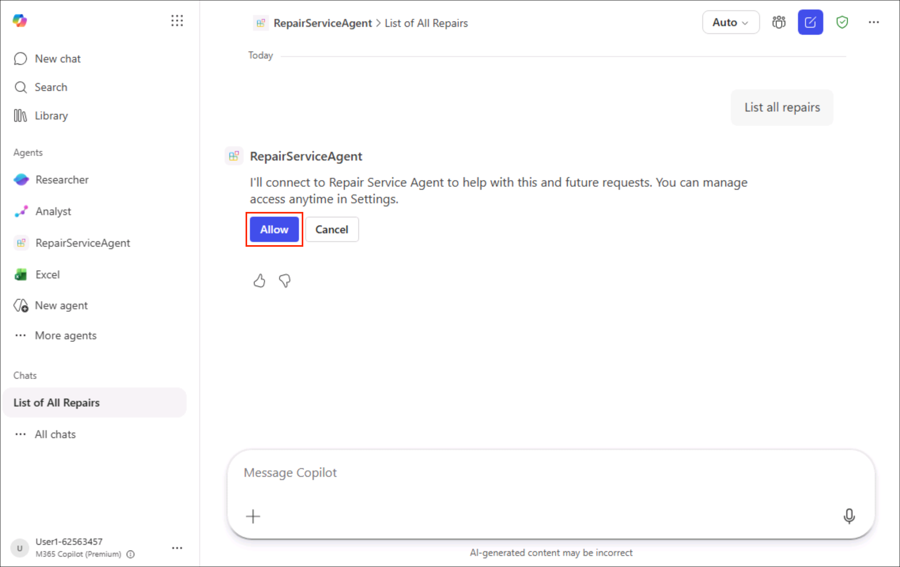

8. This initiates the conversation with your agent, and you can see the response from the agent with the list of repairs.

    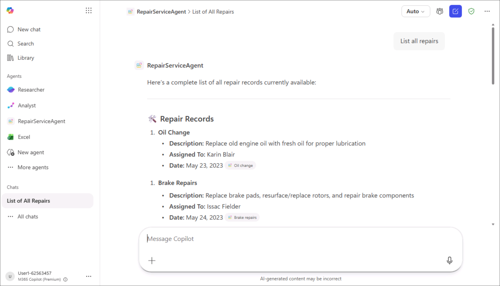

## Exercise 2: Enhance Agent capabilities

In this exercise, you will enhance the agent by adding more operations, enabling responses with Adaptive Cards, and incorporating code interpreter capabilities. Let's explore each of these enhancements step by step. Go back to the project in VS Code.

### Task 1: Modify agent to add more operations

In this task, you will modify the agent and add operations like **createRepair**, **updateRepair**, and **deleteRepair**.

1. Go to file **actions/actions.tsp** and copy paste the below snippet just after the **listRepairs** operation to add the new operations **createRepair**, **updateRepair**, and **deleteRepair**. Here you will also define the **Repair** item data model.

    ```
    /**
    * Create a new repair using the API. 
    * When creating a repair, the `id` field is optional and will be generated by the server.
    * The `date` field should be in ISO 8601 format (e.g., "2023-10-01T12:00:00Z").
    * The `title` field based on what repair user wants to create
    * @param repair The repair to create.
    */
    @route("/repairs")  
    @post  op createRepair(@body repair: Repair): Repair;
    
    /**
    * Update an existing repair.
    * The `id` field is required to identify the repair to update.
    * The `date` field should be in ISO 8601 format (e.g., "2023-10-01T12:00:00Z").
    * The `image` field should be a valid URL pointing to the image associated with the repair.
    * @param repair The repair to update.
    */
    @route("/repairs")  
    @patch(#{implicitOptionality: true})
    op updateRepair(@body repair: Repair): Repair;
    
    
    /**
    * Delete a repair.
    * The `id` field is required to identify the repair to delete.
    * @param repair The repair to delete.
    */
    @route("/repairs") 
    @delete  op deleteRepair(@body repair: Repair): Repair;
    
    /**
    * A model representing a repair.
    */
    model Repair {
    /**
    * The unique identifier for the repair.
    */
    id?: string;
    
    /**
    * The short summary or title of the repair.
    */
    title: string;
    
    /**
    * The detailed description of the repair.
    */
    description?: string;
    
    /**
    * The user who is assigned to the repair.
    */
    assignedTo?: string;
    
    /**
    * The optional date and time when the repair is scheduled or completed.
    */
    @format("date-time")
    date?: string;
    
    /**
    * The URL of the image associated with the repair.
    */
    @format("uri")
    image?: string;
    }
    }
    ```

    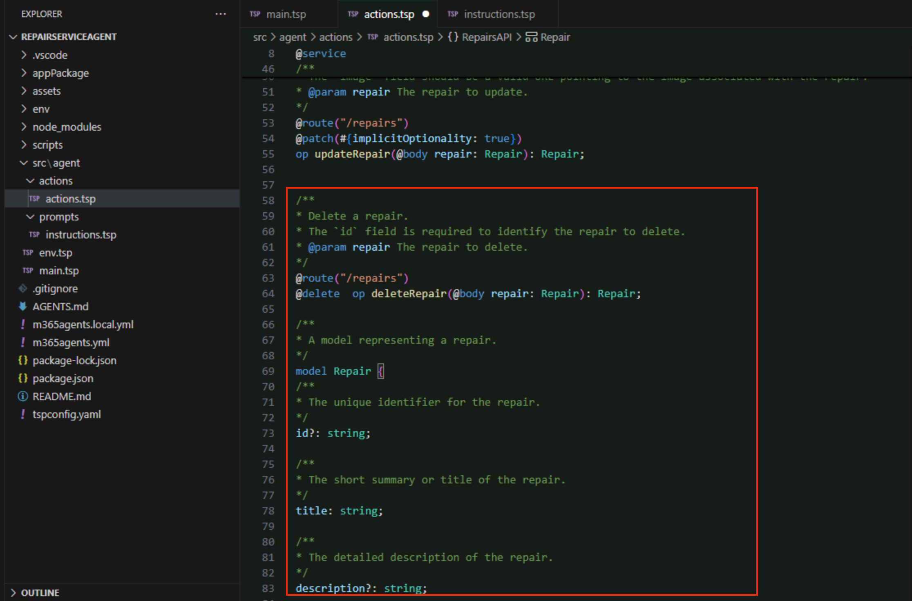

2. Now, open the **main.tsp** file and add these new operations into the agent's action. **Paste** the below snippet after the line **op listRepairs is global.RepairsAPI.listRepairs;** inside the **RepairServiceActions** namespace.

    ```
    op createRepair is global.RepairsAPI.createRepair;
    op updateRepair is global.RepairsAPI.updateRepair;
    op deleteRepair is global.RepairsAPI.deleteRepair;
    ```

    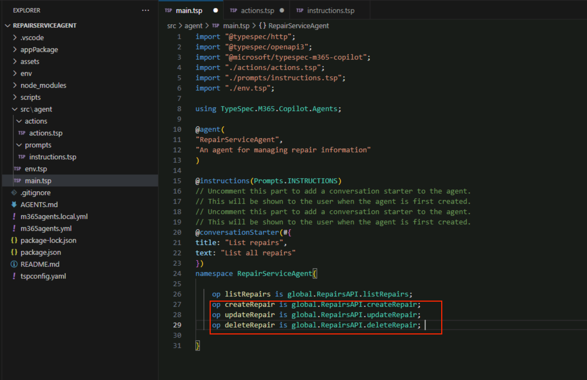

3. Also add a new conversation starter for creating a new repair item, just after the first conversation starter definition.

    ```
    @conversationStarter(#{
        title: "Create repair",
        text: "Create a new repair titled \"[TO_REPLACE]\" and assign it to me"
    })
    ```

    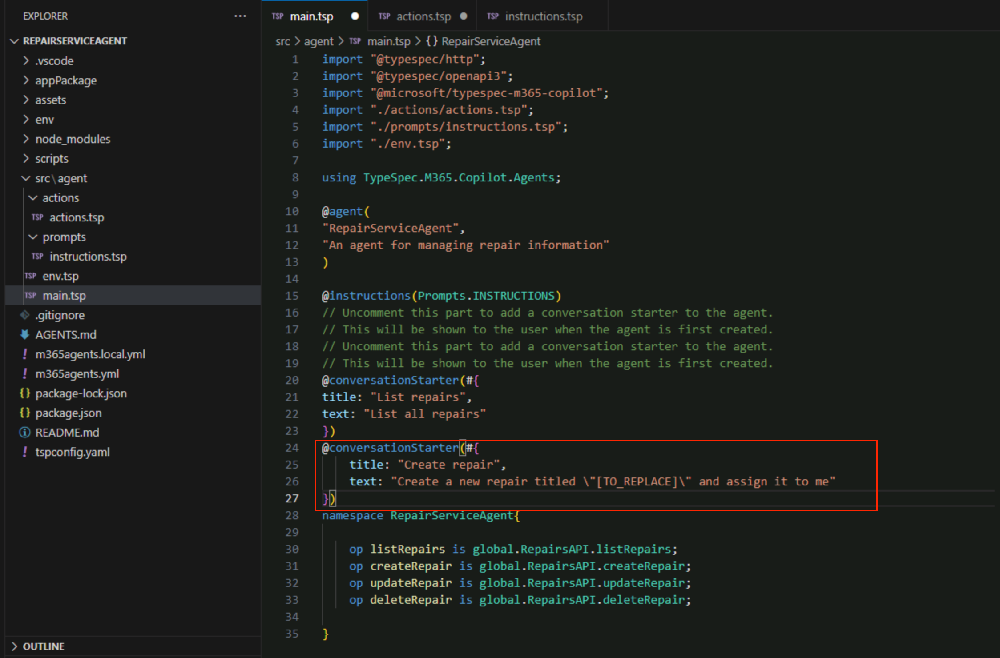

### Task 2: Add adaptive card to function reference

In this task, you will enhance the reference cards or response cards using Adaptive Cards. Let's take the **listRepairs** operation and add an Adaptive Card for the repair item.

1. In the project, go to the **adaptiveCards** folder under the **appPackage** folder. Create a new file named **repair.json** and paste the provided code snippet. This will define a new Adaptive Card for the repair object. Ignore the default template card that is already present in this folder.

    ```
    {
        "$schema": "http://adaptivecards.io/schemas/adaptive-card.json",
        "type": "AdaptiveCard",
        "version": "1.5",
        "body": [
        {
            "type": "Container",
            "$data": "${$root}",
            "items": [
                {
                    "type": "TextBlock",
                    "text": "Title: ${if(title, title, 'N/A')}",
                    "weight": "Bolder",
                    "wrap": true
                },
                {
                    "type": "TextBlock",
                    "text": "Description: ${if(description, description, 'N/A')}",
                    "wrap": true
                },
                {
                    "type": "TextBlock",
                    "text": "Assigned To: ${if(assignedTo, assignedTo, 'N/A')}",
                    "wrap": true
                },
                {
                    "type": "TextBlock",
                    "text": "Date: ${if(date, date, 'N/A')}",
                    "wrap": true
                },
                {
                    "type": "Image",
                    "url": "${image}",
                    "$when": "${image != null}"
                }
            ]
        }],  
        "actions": [
            {
                "type": "Action.OpenUrl",
                "title": "View Image",
                "url": "https://www.howmuchisit.org/wp-content/uploads/2011/01/oil-change.jpg"
            }
        ]
    }
    ```

    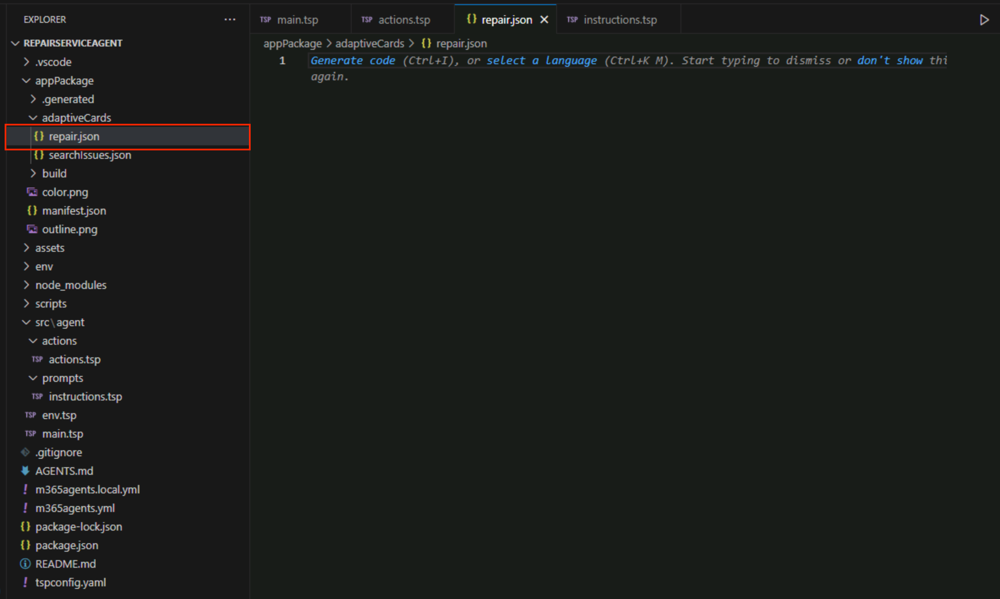

    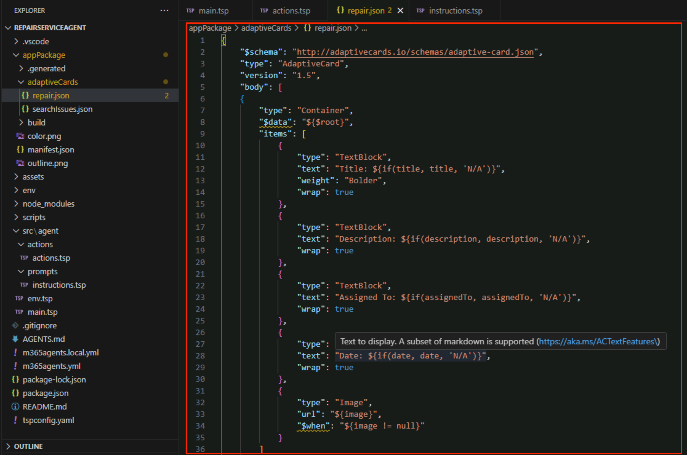

2. Next, go back to the **actions.tsp** file and locate the listRepairs operation. Just above the operation definition **@get op listRepairs(@query assignedTo?: string): string;**, paste the card definition using the below snippet.

    ```
    @card(#{  dataPath: "$", file: "adaptiveCards/repair.json",    properties: #{ title: "$.title", url: "$.image" } })
    ```

    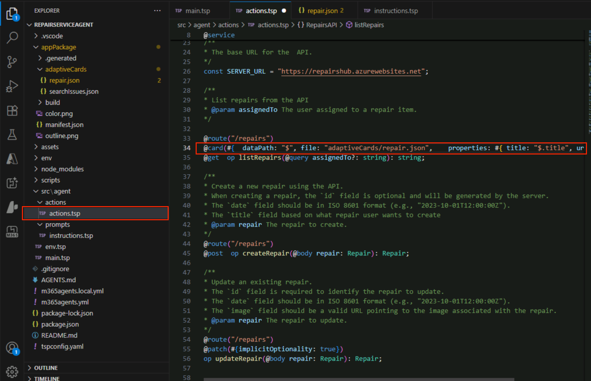

    The above card response will be sent by the agent when you ask about a repair item or when the agent brings a list of items as its reference.

3. Continue to add a card response for the **createRepair** operation to show what the agent created after the POST operation. Copy paste the below snippet just above the code **@post op createRepair(@body repair: Repair): Repair;**

    ```
    @card(#{  dataPath: "$", file: "adaptiveCards/repair.json",    properties: #{ title: "$.title", url: "$.image" } })
    ```

    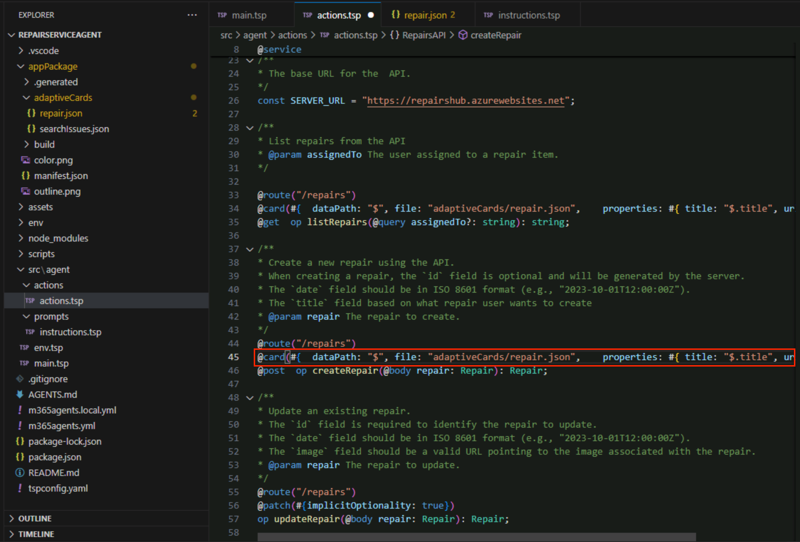

### Task 3: Update agent instruction for new operations

1. In the **src/agent/prompts/instructions.tsp** file, update the instructions definition to have additional directives for the agent. Replace the **INSTRUCTIONS** constant with the below code:

    ```
    namespace Prompts {
    const INSTRUCTIONS ="""  
        ## Purpose
        You will assist the user in finding car repair records based on the information provided by the user.

        ## Guidelines
        - You are a repair service agent.
        - You can use the actions to create, update, and delete repairs.
        - When creating a repair item, if the user did not provide a description or date, use the title as the description and put today's date in the format YYYY-MM-DD.
        - Do not use any technical jargon or complex terms.
    """;
    }
    ```

    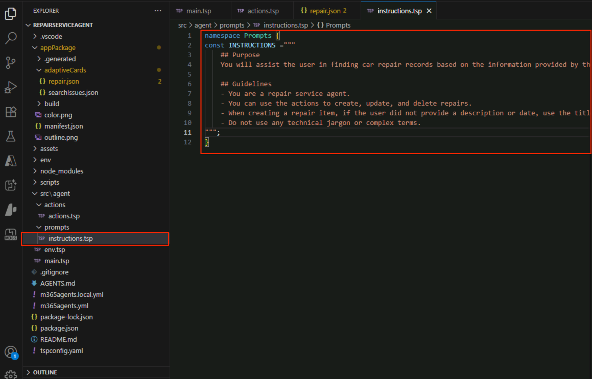

### Task 4: Provision and Test the Agent

In this task, you will take the updated agent - now also a repairs analyst - to test.

1. Select the Agents Toolkit's extension icon to open its activity bar from within your project.

2. In the activity bar of the toolkit, under **LifeCycle**, select **Provision** to package and upload the newly updated agent for testing.

    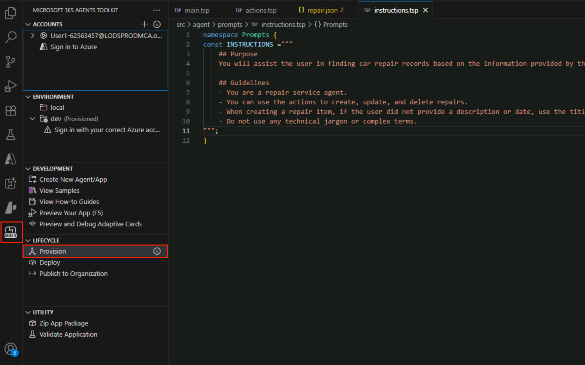

3. Ensure that the provisioning gets succeeded.

    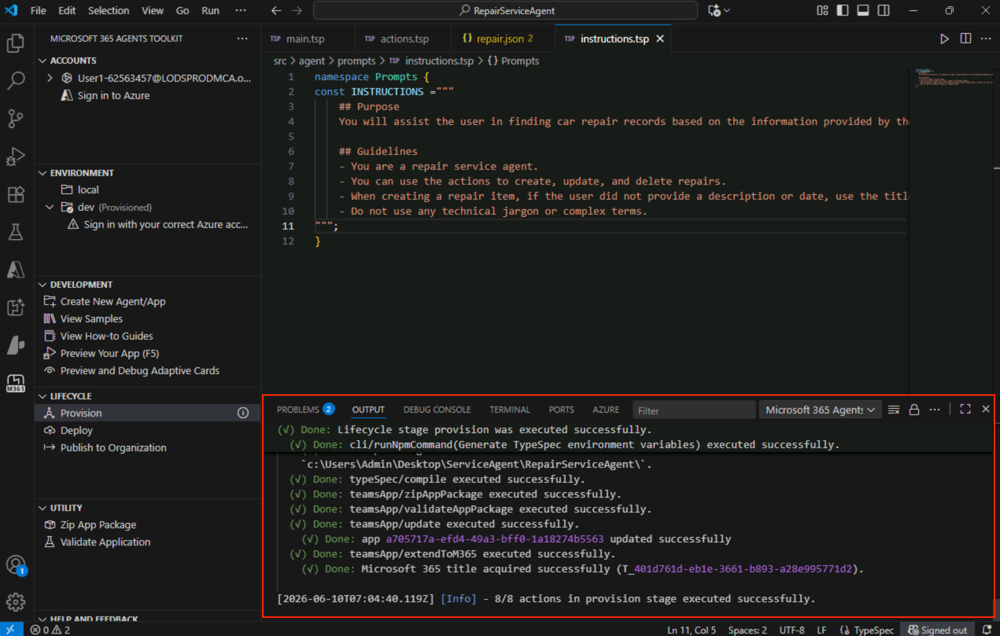

    >**Alert:** There are a couple of known issues where the Provision action in Agents Toolkit may fail with the errors shown below. If this happens, simply retry the provisioning process until it succeeds.

    

    

4. Open the web browser and navigate to **https://dev.teams.microsoft.com/** and select **Apps** from the left-hand navigation menu to verify that **RepairServiceAgentdev** is present under Apps.

    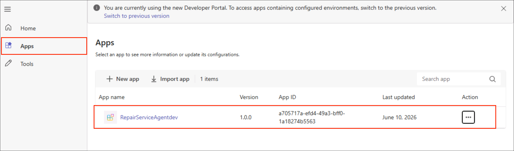

5. Go back to the **M365 Copilot page** and do a **refresh** to view the changes.

    >**Note:** It may take up to 10 mins to reflect the changes.

    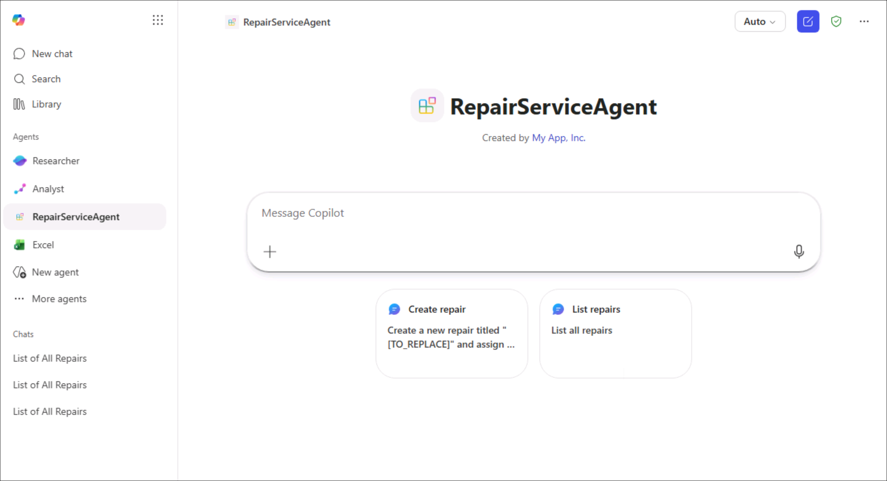

6. In the **RepairServiceAgent**, start by using the conversation starter **Create repair**.

    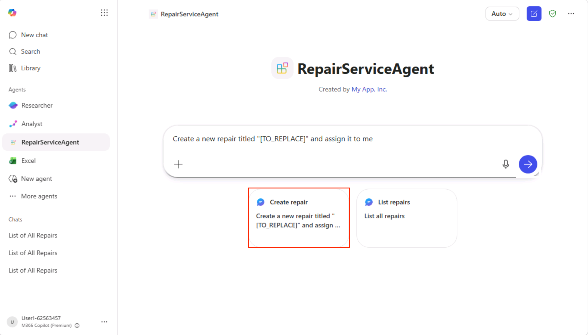

7. Replace the **"[TO REPLACE]"** with **rear camera issue** and assign it to me.

    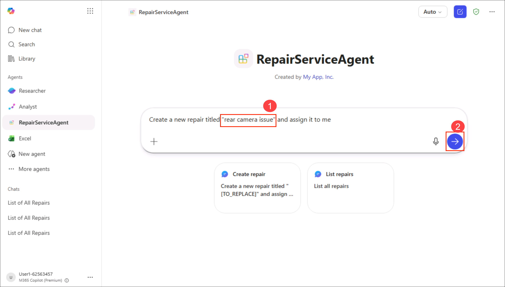

8. The confirmation dialog, if you notice, has more metadata than what you sent, thanks to the new instructions. Proceed to add the item by **confirming** the dialog.

    

9. Review the output and click on the **View Image**.

    
    
    

10. Next, you will test the new analytical capability of your agent. Open a new chat by selecting the **New chat** button on the top right corner of your agent.

    

11. Next, copy the prompt below and paste it into the message box and hit enter to send it.

    ```
    Classify repair items based on title into three distinct categories: Routine Maintenance, Critical, and Low Priority. Then, generate a chart displaying the percentage representation of each category.
    ```

    

12. You should get a response similar to the below screen. It may vary sometimes.

    
    

13. Open the link **https://dev.teams.microsoft.com/**

14. Select **Apps** from the left pane.

    

15. You will find the **RepairServiceAgent** under Apps.

16. Scroll to the right, click on the **3 dots**, and select **Delete**. This needs to be done in order to provision another agent. Since you will be creating another agent in the next lab, this step needs to be done.

    

17. Enter the name of the application as **RepairServiceAgentdev** and click on **Confirm**.

    

## Summary

In this lab, you have completed the following:

- Scaffolded a **Declarative Agent** project named **RepairServiceAgent** using Microsoft 365 Agents Toolkit
- Used **TypeSpec** to describe APIs and bind them to Copilot actions
- Defined agent metadata, instructions, and conversation starters
- Enhanced the agent with **createRepair**, **updateRepair**, and **deleteRepair** operations
- Configured **Adaptive Cards** to display repair records in a rich visual layout
- Built a complete scenario where users can interact naturally with Copilot to manage repair data
- Provisioned and tested the agent, validating both CRUD operations and built-in analytical (chart-generation) capabilities
- Cleaned up the environment by deleting the agent from `dev.teams.microsoft.com` in preparation for the next lab

This lab demonstrated how Declarative Agents leverage the Copilot platform's orchestration, foundation models, and security controls to deliver a familiar and consistent user experience while integrating with custom business data and workflows.

## You have successfully completed the lab!

### Now, click on **Next >>** from the lower right corner to move on to the next page.

   
