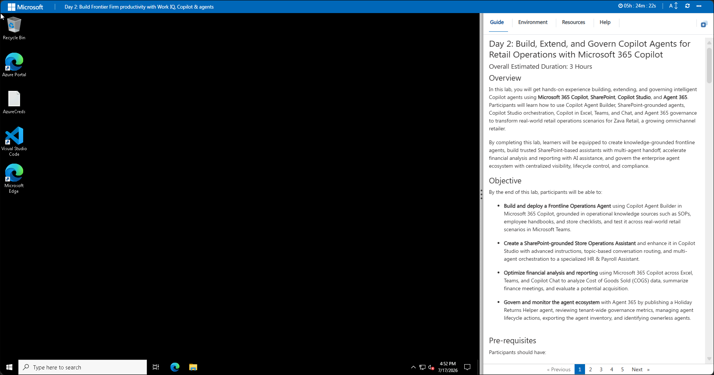
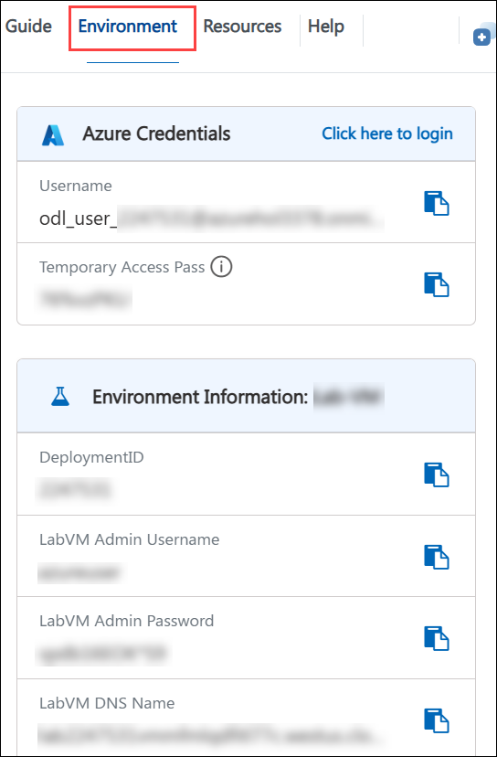
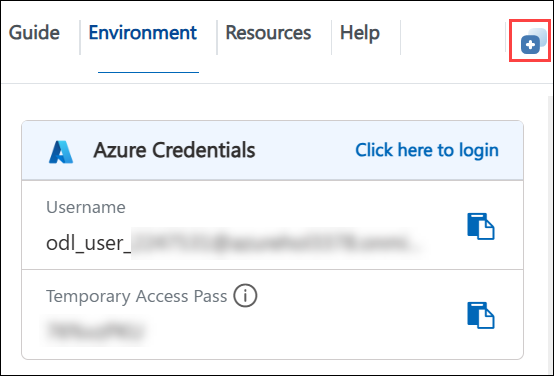

# Day 4: Build, Extend, and Govern Copilot Agents for Retail Operations with Microsoft 365 Copilot

### Overall Estimated Duration: 4 Hours

## Overview

In this lab, you will get hands-on experience building, extending, and governing intelligent Copilot agents using **Microsoft 365 Copilot**, **SharePoint**, **Copilot Studio**, and **Agent 365**. Participants will learn how to use Copilot Agent Builder, SharePoint-grounded agents, Copilot Studio orchestration, Copilot in Excel, Teams, and Chat, and Agent 365 governance to transform real-world retail operations scenarios for Zava Retail, a growing omnichannel retailer.

By completing this lab, learners will be equipped to create knowledge-grounded frontline agents, build trusted SharePoint-based assistants with multi-agent handoff, accelerate financial analysis and reporting with AI assistance, and govern the enterprise agent ecosystem with centralized visibility, lifecycle control, and compliance.

## Objective

By the end of this lab, participants will be able to:

- **Build and deploy a Frontline Operations Agent** using Copilot Agent Builder in Microsoft 365 Copilot, grounded in operational knowledge sources such as SOPs, employee handbooks, and store checklists, and test it across real-world retail scenarios in Microsoft Teams.

- **Create a SharePoint-grounded Store Operations Assistant** and enhance it in Copilot Studio with advanced instructions, topic-based conversation routing, and multi-agent orchestration to a specialized HR & Payroll Assistant.

- **Optimize financial analysis and reporting** using Microsoft 365 Copilot across Excel, Teams, and Copilot Chat to analyze Cost of Goods Sold (COGS) data, summarize finance meetings, and evaluate a potential acquisition.

- **Govern and monitor the agent ecosystem** with Agent 365 by publishing a Holiday Returns Helper agent, reviewing tenant-wide governance metrics, managing agent lifecycle actions, exporting the agent inventory, and identifying ownerless agents.

## Pre-requisites

Participants should have:

- A Microsoft 365 account with a Copilot license (Microsoft 365 Copilot or Copilot for Microsoft 365).

- Access to Microsoft Teams, Microsoft Excel, SharePoint, Copilot Studio, the Microsoft 365 Copilot portal, and the Microsoft 365 admin center.

- Basic familiarity with Microsoft 365 applications (Teams, Excel, SharePoint).

- Understanding of basic business processes such as retail operations, financial analysis, and AI agent governance.

## Architecture

In this lab, you will use the Microsoft 365 Copilot platform, SharePoint, Copilot Studio, and Agent 365 to build, extend, and govern AI agents that support retail operations at Zava Retail. The workflow begins by creating and grounding purpose-built Microsoft Copilot agents through the Microsoft 365 Copilot portal, SharePoint, and Copilot Studio, and then managing them centrally through the Microsoft 365 admin center.

Each agent is grounded in organizational data — SOPs, employee handbooks, store checklists, SharePoint document libraries, HR and payroll content, and finance workbooks — and uses AI reasoning to plan, execute, and generate outputs across different functional areas including frontline operations, store management, HR, finance, and governance.

The Copilot Agent Builder lets you configure and deploy knowledge-grounded frontline agents. SharePoint-grounded agents deliver trusted, boundary-aware responses, while Copilot Studio adds advanced instruction authoring, topic-based routing, and multi-agent orchestration. Copilot in Excel, Teams, and Chat accelerates financial analysis, meeting summarization, and acquisition evaluation. Agent 365 provides centralized governance, monitoring, lifecycle management, and compliance across the entire agent ecosystem.

## Architecture Diagram


## Explanation of Components

The architecture for this lab involves the following key components:

1. **Microsoft 365 Copilot Portal (m365.cloud.microsoft):** The primary interface for accessing and creating Copilot agents, including Copilot Agent Builder and Copilot Chat.
   - Acts as the entry point for agent creation, testing, and interaction across Microsoft 365.
   - Provides access to custom agents that can be surfaced and used directly in Microsoft Teams.

1. **Copilot Agent Builder:** A no-code tool for building custom frontline agents with defined names, instructions, and knowledge sources.
   - Supports uploading enterprise documents such as SOPs, employee handbooks, store checklists, FAQs, and shift guides as grounding knowledge.
   - Allows agents to be published and accessed directly within Microsoft Teams for frontline employees.

1. **Microsoft SharePoint:** A trusted content platform used to store and organize verified organizational knowledge.
   - Hosts team sites and document libraries containing HR documents, product specifications, project updates, shift handover notes, and SOP libraries.
   - Grounds Copilot agents so responses remain accurate and within approved knowledge boundaries.

1. **Microsoft Copilot Studio:** An advanced authoring environment for customizing and orchestrating Copilot agents.
   - Enables system prompt composition, topic-based conversation routing, and fallback handling for precise control over agent behavior.
   - Supports multi-agent orchestration, allowing a primary agent to hand off requests to specialized agents such as an HR & Payroll Assistant.

1. **Microsoft 365 Copilot in Excel, Teams, and Chat:** AI assistance embedded directly into finance and collaboration workflows.
   - Analyzes datasets such as Cost of Goods Sold (COGS), summarizes meetings, and generates task lists and follow-up communications.
   - Evaluates business scenarios such as acquisitions by producing executive summaries and comprehensive reports with visuals.

1. **Agent 365 (Microsoft 365 admin center):** A centralized governance layer for managing the organization's AI agent ecosystem.
   - Provides tenant-wide dashboards, an Agent Registry, and metrics for active users, pending requests, and ownerless agents.
   - Supports lifecycle actions such as blocking and unblocking agents, exporting the agent inventory, and reviewing governance gaps.

## Getting Started with Lab

Once you're ready to dive in, your virtual machine and **Guide** will be right at your fingertips within your web browser.



## Lab Guide Zoom In/Zoom Out

To adjust the zoom level for the environment page, click the **A↕ : 100%** icon located next to the timer in the lab environment.


## Virtual Machine & Lab Guide

Your virtual machine is your workhorse throughout the workshop. The guide is your roadmap to success.

## Exploring Your Lab Resources

To get a better understanding of your lab resources and credentials, navigate to the **Environment** tab.



## Utilizing the Split Window Feature

For convenience, you can open the lab guide in a separate window by selecting the **Split Window** button from the top right corner.



## Managing Your Virtual Machine

Feel free to **start, restart, or stop (2)** your virtual machine as needed from the **Resources (1)** tab. Your experience is in your hands!


## Let's Get Started with Microsoft 365 Copilot

1. On your virtual machine, open a web browser and navigate to the Microsoft 365 Copilot portal.
     ```
     https://m365.cloud.microsoft/
     ```
    

1. On the **Sign in** page, enter the following email/username and click **Next (2)**.

   * **Email/Username**: <inject key="AzureAdUserEmail"></inject> **(1)**
   
    
     
1. Now enter the following password and click on **Sign in (2)**.
   
   * **Password**: <inject key="AzureAdUserPassword"></inject> **(1)**
   
    

      > **Note:** If prompted to Enter Temporary Access Pass, enter the following **Password**: <inject key="AzureAdUserPassword"></inject> **(1)** and click on **Sign in (2)**.

       
     
1. If you see the pop-up **Stay Signed in?**, select **No**.

    

1. If you see the pop-up **You have free Azure Advisor recommendations!**, close the window to continue the lab.

1. If a **Welcome to Microsoft 365** popup window appears, select **Maybe Later** to skip the tour.

## Support Contact

The CloudLabs support team is available 24/7, 365 days a year, via email and live chat to ensure seamless assistance at any time. We offer dedicated support channels tailored specifically for both learners and instructors, ensuring that all your needs are promptly and efficiently addressed.

Learner Support Contacts:

- Email Support: cloudlabs-support@spektrasystems.com
- Live Chat Support: https://cloudlabs.ai/labs-support

Click **Next >>** from the bottom right corner to embark on your Lab journey!


### Happy Learning!!
